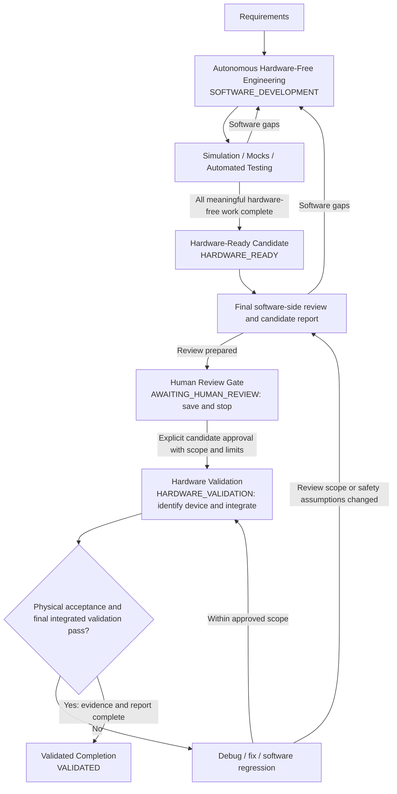
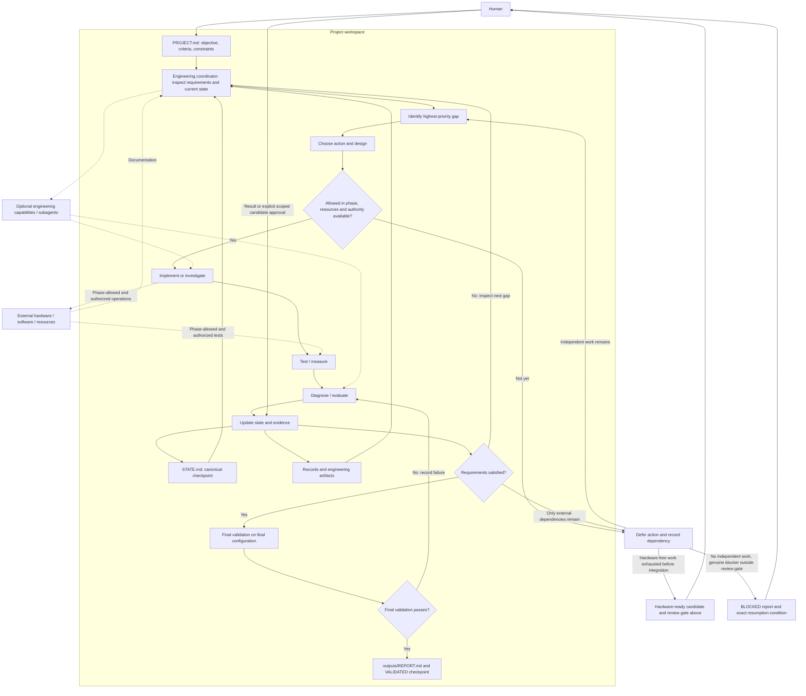

# Autonomous engineering architecture

The engineering coordinator is the active agent's role. It selects each action
from the gap between requirements and observed reality within the current phase.
The project workspace carries memory across agents. Hardware projects follow these
phase boundaries; the engineering loop below governs work inside each phase.

The normal hardware path is **Autonomous Hardware-Free Engineering → Hardware-Ready
Candidate → Human Review Gate → Hardware Validation → Validated Completion**.
Missing hardware never stops useful hardware-independent work. At HARDWARE_READY,
prepare the software-side review package described in AGENTS.md; the agent then
saves AWAITING_HUMAN_REVIEW and stops. The gate is a planned boundary, not BLOCKED.
No real-device discovery, reads, initialization, writes, tests, or cleanup occur
before explicit candidate approval. On resume, the gate remains in force; retain
applicable recorded approval rather than repeatedly requesting it.

After approval, confirm device identity and compatibility, prefer the least
consequential useful read, validate initialization/state reporting, then perform
controlled actuation and physical acceptance within limits. Software-only projects
skip the hardware gate and use SOFTWARE_DEVELOPMENT → VALIDATED after their required
tests and final validation pass.

The core loop remains **Inspect → Gap → Design → Implement → Test → Diagnose →
Update State → Repeat**, with evidence deciding the next action:

The authority/resource gate applies to **every** external action in implementation
and testing, and is checked again when conditions change. Defer a physical
dependency until meaningful independent work is exhausted, then follow the
candidate review path before requesting hardware access. Human results re-enter
the evidence/state loop; they do not bypass validation. A final-validation failure
returns to diagnosis and the gap loop. BLOCKED preserves a handoff for a genuine
external dependency; AWAITING_HUMAN_REVIEW preserves the deliberate integration
gate. Neither is a success claim or a reason to skip available software work.

Human intent lives in PROJECT.md. STATE.md points to current artifacts, test
methods, and evidence; records preserve reproducible observations and decisions.
The report describes the engineered system, configuration, demonstrated results,
and operation. Optional specialists return bounded artifacts and evidence to the
coordinator, which maintains the single canonical state.
