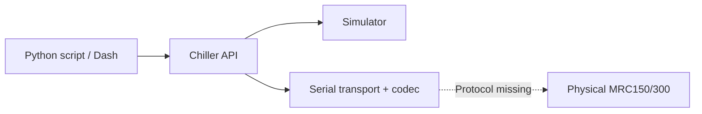

# Tark MRC150/300 chiller controller

Control a laboratory chiller from Python: read its temperature, change an approved
setpoint (target temperature), record CSV data, and watch a live dashboard.
[examples/lab.py](examples/lab.py) is the main entry point for real equipment.

**Current status — version 0.3.0:** the software passes 218 tests, but real-hardware
operation is blocked by the missing controller communication manual and Tark
protocol implementation. No physical MRC150/300 has been validated.
The lab script refuses incomplete configuration and never substitutes a simulator.

**Lab workflow:** Install → Configure your unit → Read and verify → Record →
Change an approved target → Shut down safely.

<a id="hardware-quick-start"></a>

## 1. Install

Use **Windows PowerShell** in the repository folder containing `pyproject.toml`.
Check `python --version` is **3.12+** before continuing. Windows / Python 3.12.14
is the tested platform; other platforms and versions have not been exercised.

```powershell
python -m venv .venv
.\.venv\Scripts\python -m pip install -c requirements-tested.txt ".[gui,serial]"
```

This installs serial communication and the dashboard. No environment activation
is needed. Complete the configuration and review below before running hardware commands.

## 2. Configure and connect your chiller


1. **Identify the equipment.** Record the chiller model/suffix, controller model,
   firmware, adapter and coolant. Obtain the matching controller communication
   manual. Follow the unit's manual and lab procedure for plumbing, power and wiring.
2. **Verify communication.** Confirm the actual RS-232 or RS-485 interface, adapter,
   pinout and serial settings. The software has both transport paths; compatibility
   with your unit/adapter is unverified. No baud rate, pinout or address is supplied.
3. **Supply the missing protocol.** A *codec* translates operations into the
   controller's command/reply format. A documented, tested implementation is needed;
   installing pySerial or entering a COM port does not provide it.
   After changes under `src/tark_chiller`, rerun the pip install command in step 1
   so the environment uses the updated driver.
4. **Edit the connection entries** at the top of [examples/lab.py](examples/lab.py):

   | Entry | What to enter |
   | --- | --- |
   | `SERIAL_SETTINGS` | Verified port, baud rate, framing, flow control and RTS/DTR levels |
   | `CODEC_CLASS` | Tested codec class for the identified controller |
   | `RS485_MODE` | Verified native direction settings if required; otherwise `None` |

5. **Review the setup before connection.** Obtain explicit authorization for the
   concrete hardware candidate and setup before opening a port. Even reads and
   port opening may have side effects. Connect using the verified wiring procedure.

See the [hardware guide](docs/hardware.md) for every configuration field and the
staged validation procedure. Leave required entries unset until verified.

## 3. Read and verify the connection

Use one program per chiller at a time. Stop an active monitor/dashboard before
starting another lab command; the dashboard can submit targets within its own session.

After configuration and authorization, start with a single read:

```powershell
.\.venv\Scripts\python examples/lab.py read
```

It prints temperature, reported setpoint and status without requesting a target
change. Check that the backend is **hardware** and compare Celsius readings with
the front panel and approved reference instrument. Resolve unexpected replies
before continuing.

**With the shipped configuration:** expect `Hardware not configured`, a nonzero
exit and `No port was opened`. This is the intended behavior until setup is complete.

## 4. Record an experiment

After the initial reads are verified, make a **five-second read-only recording**:

```powershell
.\.venv\Scripts\python examples/lab.py log --csv outputs/check.csv
```

Check the reported saved rows and failed polls, then open `outputs/check.csv`.
CSV contains UTC time, elapsed seconds, temperature/setpoint in °C, backend,
connection status and errors. Failed readings are blank.

For **continuous read-only monitoring and recording**:

```powershell
.\.venv\Scripts\python examples/lab.py monitor --csv outputs/experiment.csv
```

Press **Ctrl+C in the terminal** to finish. Omit `--csv` if you only need terminal
readings. Each recording needs a new filename; existing files are never overwritten
and cannot be appended to.

## 5. Change an approved target

Only after read validation and explicit write approval, enter your approved
Celsius target:

```powershell
$targetC = Read-Host "Approved target in Celsius"
.\.venv\Scripts\python examples/lab.py set $targetC
```

The script reads the original target, writes once, and checks exact readback.
A mismatch is reported as unconfirmed; it does not retry. **Matching readback
confirms the target, not that the liquid has reached it.** Observe temperature
independently before relying on it for the experiment.

<a id="optional-dashboard"></a>

## 6. Use the dashboard

After the approved connection checks:

```powershell
.\.venv\Scripts\python examples/lab.py gui --csv outputs/dashboard.csv
```

Open **[http://127.0.0.1:8050](http://127.0.0.1:8050)**. Check:

| On screen | What to look for |
| --- | --- |
| Session status | **hardware** backend, recent connected poll |
| Temperature / reported setpoint | Celsius values and a fresh sample age |
| Recording | CSV enabled and rows increasing |
| Faults and history | Investigate errors, stale readings or gaps |

Use **Requested temperature (°C) → Apply setpoint** only for approved targets.
Watch the reported setpoint for readback. Omit `--csv` to use the dashboard without
recording. Closing the browser leaves monitoring running; stop with **Ctrl+C in
the terminal**.


*Interface preview captured with the simulator. This is not a hardware measurement;
when connected to real equipment, verify that the backend badge says **hardware**.*

## Use it in a Python experiment

After hardware configuration and approved read validation, run from the repository
root with the same environment's Python:

```python
from examples.lab import create_chiller

with create_chiller() as chiller:
    print(chiller.read_temperature())  # Celsius
    print(chiller.read_setpoint())     # Reported target, Celsius
    print(chiller.read_status())
```

The context connects on entry and disconnects on exit. It starts no monitoring
or GUI. See the [API guide](docs/api.md) for optional monitoring and CSV recording.

## Safety and shutdown

- **Default targets: 2–40 °C inclusive, distilled-water profile.** Confirm these
  limits apply to the actual unit and coolant. Other coolant/range choices need
  a named profile and documented source.
- **No verified coolant, leak, flow, level or alarm telemetry.** Connection status
  and the absence of software errors do not establish physical safety.
- **No automatic write retries or replay.** Investigate failed or unconfirmed
  writes before making another request. Polling is not real time.
- **Ctrl+C stops monitoring and closes CSV and the software connection.** It does
  **not stop the physical chiller, pump or cooling**. Follow the equipment shutdown
  procedure separately; no serial stop command is documented.
- Resolve stale readings and cleanup timeouts before relying on the data or assuming
  the connection/file has closed. Software tests do not establish calibration.

## Troubleshooting

| Symptom | Next step |
| --- | --- |
| Hardware not configured | Supply verified settings and a tested codec; see step 2. No port was opened. |
| Port missing, denied or busy | Check the approved adapter's OS port, permissions and competing applications. |
| Timeout or malformed reply | Check documented wiring/settings; stop relying on old readings and investigate uncertain writes. |
| Target rejected / readback differs | Check the approved Celsius value and configured bounds; do not blindly retry. |
| CSV exists / recording failed | Use a new filename; check free space, permissions and recording status. |
| Browser cannot connect | Keep the launch terminal open; check its errors and whether port 8050 is already in use. |
| Python or import error | Use Python 3.12+ and the same `.venv` for install/run; run Python examples from the repository root. |

[More troubleshooting](docs/troubleshooting.md).

## Optional: try the interface without hardware

The simulator is a development/demo tool. With the installation above:

```powershell
.\.venv\Scripts\python -m tark_chiller
```

Open [127.0.0.1:8050](http://127.0.0.1:8050), verify the **simulator** badge, and try
an 18 °C target. The modeled temperature starts at 20 °C and approaches the target.
Stop with Ctrl+C. For a five-second CSV test without a browser:

```powershell
.\.venv\Scripts\python -m tark_chiller --headless --duration 5 --csv outputs/demo.csv
```

The module launcher and `tark-chiller` always use the simulator; they cannot select
hardware. The model is uncalibrated and predicts no physical chiller performance.

## For developers

The synchronous `Chiller` API owns a simulator or serial backend. Monitoring/CSV
and Dash are optional clients; core installation has no third-party dependencies.



**Validation:** 218 software tests and a 60-second integrated simulator run pass.
Serial tests use in-memory endpoints. Physical compatibility and temperature
performance remain unvalidated. [Validation report](outputs/REPORT.md).

[Development and tests](development/README.md) · [API](docs/api.md) ·
[Requirements](PROJECT.md) · [Current state](STATE.md) ·
[Validation evidence](records/RECORDS.md#e036)
