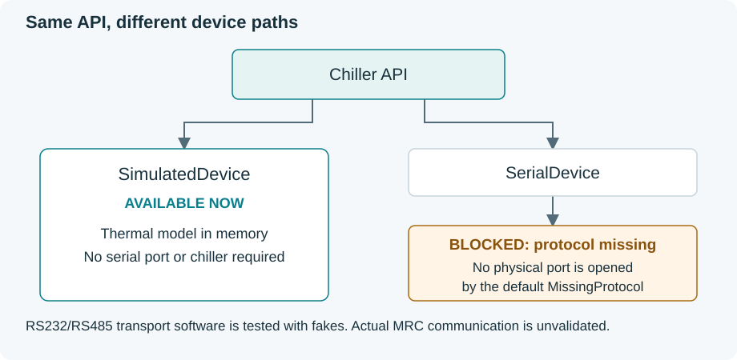

# Tark MRC150/300 Python controller

A small driver for laboratory scripts: connect, read temperature, set a target,
and optionally monitor to CSV. Use the simulator now; add the dashboard when you
need a live display.

**Real MRC control is not available yet.** The matching controller communication
manual is missing. No physical chiller has been validated. [Hardware guide](docs/hardware.md).

## Use it in a script

```python
from tark_chiller import Chiller, Simulator

with Chiller(Simulator()) as chiller:
    print(chiller.read_temperature())  # Celsius
    chiller.set_setpoint(18.0)
    print(chiller.read_setpoint())
```

The context manager connects on entry and disconnects on exit. Import and
construction do not open devices or start threads. Keep one Chiller instance for
your experiment. [Function-by-function API](docs/api.md).

## Install and run

Use Python **3.12 or newer**. From the downloaded project folder in Windows
PowerShell, check `python --version`, then install the driver:

```powershell
python -m venv .venv
.\.venv\Scripts\python -m pip install .
.\.venv\Scripts\python examples/01_read_temperature.py
```

Expect **Temperature: 20.00 Celsius** and simulator status.
The base driver has no external dependencies.

For the optional dashboard:

```powershell
.\.venv\Scripts\python -m pip install -c requirements-tested.txt ".[gui]"
.\.venv\Scripts\python -m tark_chiller --csv outputs/session.csv
```

Open **[127.0.0.1:8050](http://127.0.0.1:8050)**. Request an **18 °C** target
and watch the simulator cool from 20 °C. Press **Ctrl+C in the terminal** to stop
monitoring and close CSV. Choose a new filename for each run.


[Quick start](docs/quickstart.md) · [Dashboard tour](docs/usage.md#dashboard-tour)

## What it provides

- One explicit API for the simulator and the future serial device.
- Celsius setpoint validation; default distilled-water limits **2–40 °C**.
- Optional background monitoring, bounded history and flushed CSV rows.
- Clear connection/recording errors and bounded optional read recovery.
- A Dash/Bootstrap display that reads snapshots independently of acquisition.

Software cannot establish installed coolant, flow, leaks or fluid level.
Connection is not proof of physical safety. Writes are never retried or replayed.

## Monitor an experiment

```python
from time import sleep
from tark_chiller import Chiller, Simulator

with Chiller(Simulator()) as chiller:
    monitor = chiller.start_monitoring(interval_s=1, csv_path="experiment.csv")
    sleep(5)
    chiller.stop_monitoring()
    snapshot = monitor.snapshot()
    if snapshot.service_error or snapshot.logging_error:
        raise RuntimeError(snapshot.service_error or snapshot.logging_error)
    print(snapshot.logged_samples)
```

`stop_monitoring()` closes recording and keeps the device connected.
`disconnect()` also stops monitoring and closes CSV. There is no separate logger
or live-state object to manage. [Monitoring](docs/api.md#monitoring).

## Numbered examples

Run each with `.\.venv\Scripts\python`. Examples 01–05 use the simulator.

| Example | Result |
| --- | --- |
| [01 · Read temperature](examples/01_read_temperature.py) | One temperature, target and status read |
| [02 · Set temperature](examples/02_set_temperature.py) | Request 18 °C and read the target back |
| [03 · Log temperature](examples/03_log_temperature.py) | Five seconds in `outputs/03_temperature.csv` |
| [04 · Monitor an experiment](examples/04_monitor_experiment.py) | Ten seconds of cooling, progress and CSV |
| [05 · Launch dashboard](examples/05_launch_dashboard.py) | The standard simulator dashboard |
| [06 · Hardware configuration](examples/06_hardware_configuration.py) | Template; reports the missing protocol |

For continuous recording without a browser:

```powershell
.\.venv\Scripts\python -m tark_chiller --headless --csv outputs/experiment.csv
```

Stop with Ctrl+C; add `--duration 60` for a one-minute run.
CSV files are never overwritten or appended automatically.

## Real hardware

The [hardware tutorial](docs/hardware.md) covers connection, port identification,
read-only validation, recording, target changes, GUI use and shutdown. It is a
preparation guide until the correct protocol is implemented and reviewed.

The serial backend accepts explicit settings and an optional RS-485 mode.
It refuses to open a port without a codec. Installing pySerial does not supply
the controller protocol. No baud rate, pinout or command is guessed.



## Compatibility and validation

| Scope | Evidence |
| --- | --- |
| Simulator | Script API, validation, monitoring, CSV and GUI tested without hardware |
| Fake serial | Production serial path tested with memory endpoints and injected failures |
| Physical MRC150/300 | **Not validated; authoritative communication protocol missing** |
| Windows / Python 3.12 | Development and validation platform |
| Other systems / Python versions | Python 3.12+ declared; other platforms not exercised here |

Version **0.2** replaces the earlier multi-object API. Update old scripts using
the [API guide](docs/api.md); old `get_*` names and separate monitor/logger
constructors are not retained.

[Quick start](docs/quickstart.md) · [API](docs/api.md) ·
[Dashboard and CSV](docs/usage.md) · [Hardware](docs/hardware.md) ·
[Troubleshooting](docs/troubleshooting.md)

For contributors: [development and validation](development/README.md).
