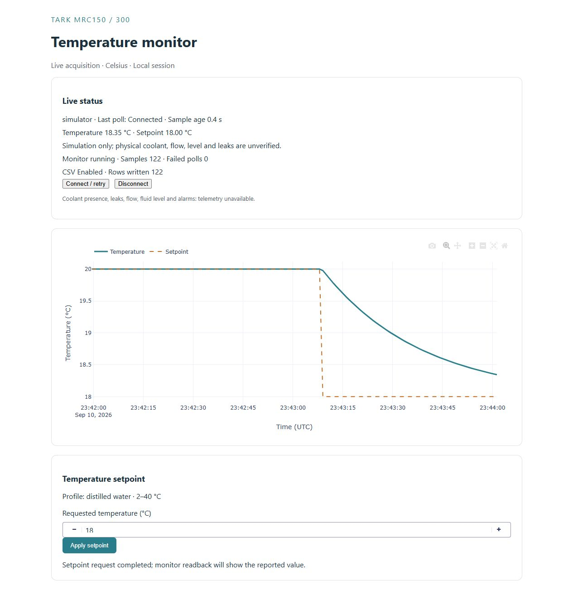

# Tark MRC150/300 controller

Use this Python app to run a simulated chiller, watch its temperature in a browser,
and save readings to a CSV file for a spreadsheet. You can change the **setpoint**
(target temperature) from the Plotly Dash dashboard or from Python.

**Real-hardware operation is not available yet.** The controller communication
manual is missing, so the commands needed to control an MRC150/300 are unknown.
No physical chiller has been tested with this software.

**Start here:** [Quick start](docs/quickstart.md) ·
[Using the GUI and Python API](docs/usage.md) ·
[Troubleshooting](docs/troubleshooting.md)

*Actual simulator session. The dashboard shows the latest readings, how old they
are, and whether CSV recording is working.*

## What you can use today

| Evidence level | What has been demonstrated |
| --- | --- |
| **Simulator-tested** | Setpoint limits, gradual temperature changes, background monitoring, CSV recording and dashboard controls/plots. |
| **Fake-serial-tested** | Serial communication code tested against a software stand-in: timeouts, disconnects, invalid replies, reconnection and protection against repeated writes. These tests use no real port or Tark commands. |
| **Real-hardware-validated** | **None.** The actual chiller, controller commands, connection, coolant limits and physical performance still need to be checked. |

The default setpoint range is **2–40 °C**, including both limits. All temperatures
are Celsius. The software cannot check coolant presence, flow, leaks or fluid
level. See [safety and hardware limits](docs/usage.md#safety-and-hardware-limits).

## How it fits together

Temperature monitoring and CSV recording keep running when you close the browser
tab. Press **Ctrl+C in the launching terminal** to stop the application.

## For maintainers

[Architecture and checks](ARCHITECTURE.md) · [Requirements](PROJECT.md) ·
[Current state](STATE.md) · [Engineering report](outputs/REPORT.md).
The project follows [agentic-engineering-template](https://github.com/cct1123/agentic-engineering-template);
[AGENTS.md](AGENTS.md) defines its engineering workflow, with evidence in
[records](records/RECORDS.md) and requests in [prompt log.md](prompt%20log.md).
