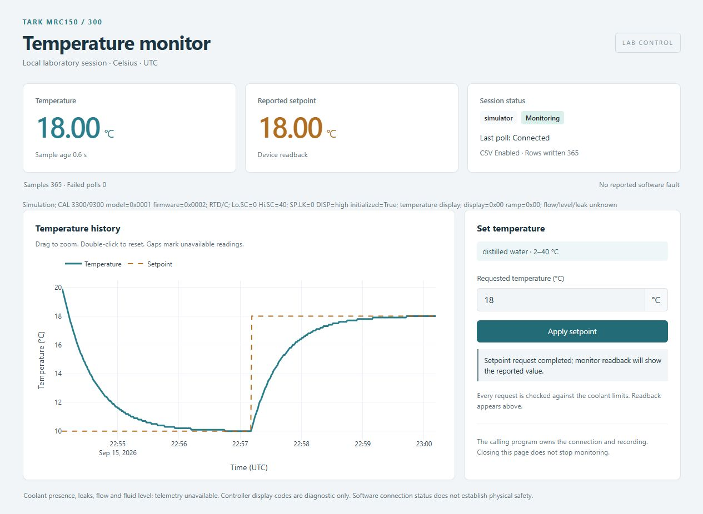
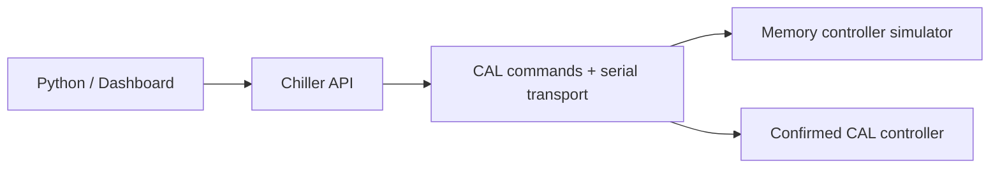

# Tark MRC150/300 chiller controller

Read chiller temperature from Python, change an approved target, record CSV data,
and watch a live dashboard. Start real-equipment sessions with
[examples/lab.py](examples/lab.py).

**Version 0.4.0 — software candidate for human hardware review.** CAL 3300/9300
commands and a byte-protocol simulator are implemented. **No physical chiller has
been tested, and the controller fitted to your unit has not been confirmed.**
The supplied MRC manual does not name it. Use this driver only after a human
confirms a supported CAL controller, its interface and the setup below.

| Available now | Still needs a human hardware test |
| --- | --- |
| CAL identity, temperature, target and display-state reads | Installed controller/firmware, wiring and adapter |
| Checked target changes; writes disabled initially | Readback, restart behavior and physical temperature response |
| Protocol simulator, CSV and dashboard | Flow, leaks, coolant suitability and calibration |

**Install → Test without hardware → Identify and connect → Read → Record → Approved control**

<a id="hardware-quick-start"></a>

## 1. Install and test without hardware

In **Windows PowerShell**, from this repository, use Python **3.12+**:

```powershell
python -m venv .venv
.\.venv\Scripts\python -m pip install -c requirements-tested.txt ".[gui,serial]"
.\.venv\Scripts\python -m tark_chiller --cal --headless --duration 5 --csv outputs/demo.csv
```

Expected: simulator starts, records samples, then stops. The CSV contains
**simulator** rows. Use a new filename on repeat runs. --cal exercises the actual
CAL commands through a memory-only controller; it opens no physical port.
Windows / Python 3.12.14 is the tested platform.

## 2. Prepare your real chiller


1. **Identify it.** Record the full MRC model, controller label and firmware.
   Supported candidate: **CAL 3300/9300**, RTD input, Celsius. Other controllers,
   Fahrenheit, linear input and sub-zero operation are not enabled.
2. **Prepare plumbing and power using your unit manual.** Fill/purge the coolant
   circuit, check leaks and flow, and provide the specified clearance and grounding.
3. **Verify the serial link.** Confirm RS-232/RS-485, the cable pinout, adapter and
   OS port. Rev 13 lists **DH2 as RS-232**; generic RS-485 support does not prove
   that your chiller has RS-485. Do not infer wiring from the connector shape.
4. **Edit [examples/lab.py](examples/lab.py)** using the
   [configuration tutorial](docs/hardware.md#configure-the-lab-script):

   | Setting | Enter |
   | --- | --- |
   | SERIAL_SETTINGS | Verified port, baud, framing and adapter line settings |
   | CAL_ADDRESS | Address shown in the communication menu, 1–247 |
   | ALLOW_WRITES | Leave False for first connection |
   | EXPECTED_MODEL, EXPECTED_FIRMWARE | Initially None; record read results before enabling writes |
   | RS485_MODE | Adapter-specific native direction settings, only if required |

5. **Have the lab reviewer approve the candidate and setup** before connection.
   Use the [human test checklist](docs/hardware.md#human-hardware-test).

The CAL communication guide is now linked and implemented. You no longer need to
write a codec. The shipped script leaves your port and address unset: running it
now reports **Hardware not configured / No port was opened**.

## 3. Read and verify

After setup and read-only approval, run one program per chiller:

```powershell
.\.venv\Scripts\python examples/lab.py read
```

Connection first reads CAL model/firmware, input type and units; incompatible
replies stop the session. The command then prints temperature, target and status.
Confirm **hardware**, record the identity codes, and compare readings with the
front panel and an approved reference. Codes distinguish the CAL family/output
configuration; they cannot distinguish a 3300 from a 9300 chassis.

One basic Python example, run from the repository root:

```python
from examples.lab import create_chiller

with create_chiller() as chiller:
    print(chiller.read_temperature())  # Celsius
    print(chiller.read_setpoint())     # Reported target, Celsius
    print(chiller.read_status())
```

The context closes the software connection on exit.

## 4. Record data

Five-second read-only check, then continuous monitoring if approved:

```powershell
.\.venv\Scripts\python examples/lab.py log --csv outputs/check.csv
.\.venv\Scripts\python examples/lab.py monitor --csv outputs/experiment.csv
```

Check saved rows and failed polls. CSV includes UTC time, elapsed time,
temperature/target in °C, status and errors. Failed readings are blank.
**Ctrl+C** ends continuous monitoring. Existing CSV files are never overwritten.

## 5. Change an approved target

After successful read tests, the reviewer must approve writes, including the
controller restart they cause. Enter the observed EXPECTED_MODEL and
EXPECTED_FIRMWARE codes in lab.py, then set ALLOW_WRITES = True.

```powershell
$targetC = Read-Host "Approved target in Celsius"
.\.venv\Scripts\python examples/lab.py set $targetC
```

The driver checks coolant bounds, controller limits, lock, initialization, mode
and resolution. It sends the documented lock → target → save/restart sequence,
then verifies target readback. **A confirmed target does not mean the liquid has
reached it.** A failed sequence is never retried or automatically unlocked.

## 6. Dashboard and shutdown

<a id="optional-dashboard"></a>

```powershell
.\.venv\Scripts\python examples/lab.py gui --csv outputs/dashboard.csv
```

Open [127.0.0.1:8050](http://127.0.0.1:8050). Check the **hardware** badge, fresh
readings and recording count. Target controls work only when writes are enabled.
Closing the browser leaves acquisition running; **Ctrl+C in the terminal** stops it.



*Simulator screenshot; it is not a hardware measurement.*

**Software disconnect does not stop the chiller, pump or cooling.** Follow the
equipment shutdown procedure separately. No power-off command is implemented.

## Safety and limitations

- Default software target bounds: **2–40 °C**, distilled-water profile. Confirm
  applicability to your coolant and unit. The [hardware guide](docs/hardware.md)
  records conflicting manufacturer coolant guidance that needs resolution.
- CAL targets must match DISP: **0.1 °C** in high resolution or **1 °C** in low
  resolution. Values are rejected, never silently rounded.
- Display/alarm codes are diagnostic information. Flow, coolant level and leaks
  remain **unknown** to the software. Connection is not proof of safety.
- A lost write reply can leave the keypad locked or a target staged/saved.
  Stop, inspect the unit, and follow the [recovery procedure](docs/hardware.md#uncertain-write-or-shutdown).
- No unattended control, physical calibration or cooling-performance claim has
  been validated. Simulator dynamics are illustrative.

## Troubleshooting

| Message / symptom | Next step |
| --- | --- |
| Hardware not configured | Fill verified settings and CAL_ADDRESS; no port opened. |
| Unsupported identity / RTD / Celsius | Compare the actual controller with the supported profile; do not bypass the check. |
| Port missing, denied or busy | Check the approved adapter's port and close other control programs. |
| Timeout / CRC error | Check wiring, address, baud and parity; stop using stale readings. |
| Writes disabled / target rejected | Check approval, identity codes, limits, SP.LK and DISP. |
| Write outcome uncertain | Human inspection required; no blind retry or automatic unlock. |
| CSV exists | Choose a new filename. |
| Import error after source update | Rerun the install command in step 1. |

[More troubleshooting](docs/troubleshooting.md) · [API and CSV](docs/api.md)

## Optional simulator practice

```powershell
.\.venv\Scripts\python -m tark_chiller --cal
```

Open the local dashboard and verify **simulator**. Try an 18 °C target: the
synthetic liquid starts at 20 °C, with the manual's 10 °C factory target, and moves
gradually toward the requested value. Ctrl+C stops the demo. Omitting --cal
selects the simpler thermal simulator. Neither launcher can select hardware.

## Implementation and validation



The same transport and command sequence run in the protocol simulator and hardware
path. Automated tests cover published bytes, identity/configuration rejection,
each interrupted write stage, monitoring and cleanup. Physical testing remains
pending. See the [current validation report](outputs/REPORT.md).

[Hardware tutorial](docs/hardware.md) · [Protocol sources and scope](docs/protocol.md) ·
[Development](development/README.md) · [Current state](STATE.md)
