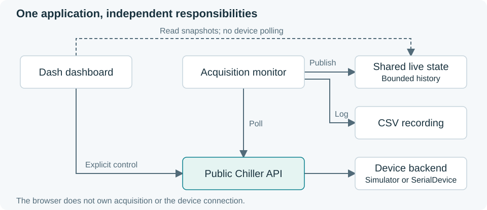
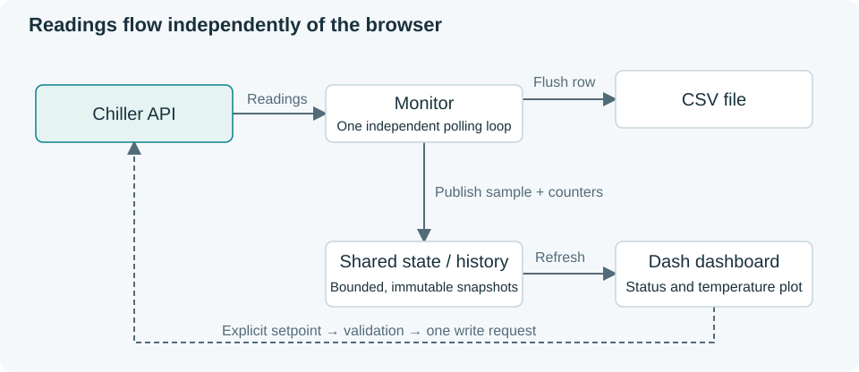

# Architecture

[Development guide](README.md) · [Public API](../docs/api.md)

The main object is Chiller. It owns one backend, serializes device operations and
validates every public target request. Construction has no I/O or worker side
effects. The driver works directly inside an existing Python experiment.

## Modules and dependency direction

| Module | Responsibility |
| --- | --- |
| controller.py | Chiller API, Celsius validation, connection/recovery ownership |
| simulator.py | Small uncalibrated thermal backend with no worker |
| serial.py | Explicit serial settings, codec interface and bounded transactions |
| monitor.py | Optional worker, bounded snapshots and new-file CSV recording |
| gui.py | Optional snapshot display and validated target control |
| errors.py | Protocol exceptions; ordinary failures use Python's standard exceptions |
| __main__.py | Simulator launcher; owns application startup and shutdown |

Application → Chiller → backend. SerialDevice encodes and checks messages through
a codec while handling the endpoint directly. The actual Tark codec is absent;
no codec means refusal before endpoint construction. A serial factory supplies
memory endpoints in tests. There is no separate transport manager or factory layer.

Chiller creates monitoring only on `start_monitoring()`. The returned handle
provides `snapshot()`; the worker owns its history and CSV. Dash receives the
existing Chiller and monitor and starts no work. Package imports do not require
GUI or serial extras.

The five researcher examples use SerialDevice. Their single connection.py file
holds explicit lab settings and constructs a fresh disconnected Chiller per call.
It is ordinary editable example code, not package configuration machinery. No
example imports Simulator or the simulator launcher. Missing settings or codec
produce a clear error before device creation; no fallback is selected.

## Safety and lifecycle

Use one driver per backend. Setpoint validation lives in Chiller; backend I/O
hooks are private and are not an alternative control API. Default water limits
are 2–40 °C. Changed bounds/coolant require a source. No software policy proves
installed coolant, leak, flow or fluid level.

Reads and writes share the driver lock. Connection intent cancels pending
recovery and queued targets across explicit connect/disconnect calls. Read
recovery has a finite outage budget; protocol errors suspend it. Writes are never
retried or replayed.

`stop_monitoring()` joins the worker and closes CSV while preserving connection.
`disconnect()` cancels recovery, closes the backend, joins monitoring and closes
its CSV. Stop timeout remains an error, not proof of successful cleanup. OS calls
that ignore their timeout cannot be forcibly interrupted by Python.
CSV close runs outside the snapshot lock, so snapshots and stop-timeout errors
remain available while filesystem cleanup is pending. Serial settings and
transaction limits are fixed at construction, including across reconnects.
The monitoring interval is also read-only; stop and start a new run to change it.

Snapshots are immutable, history is bounded, and poll timestamps refer to the
start of sequential reads. A failed poll has missing values. CSV failure remains
visible while acquisition can continue. Each recording uses a new file; no append,
schema migration, session manager or process-wide owner registry is needed.

## Protocol and validation limits

Obtain the matching controller manual and identity before implementing
baud/parity/data/stop bits, addresses, commands/registers, framing/terminators,
read/write semantics, acknowledgements/errors, CRC/checksum, units/scaling,
response correlation, timing and side effects. Cite each implemented operation
and test source-derived byte fixtures.

No physical validation follows from simulator or memory-serial tests.
[Current state](../STATE.md) links applicable evidence and dependencies.
[Development guide](README.md#run-the-checks) contains reproducible checks.
