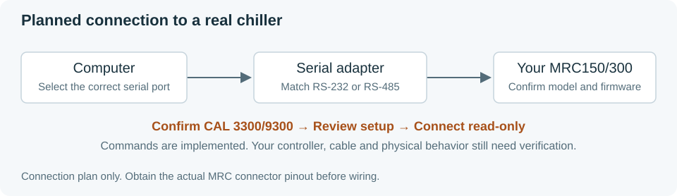

# Hardware connection and validation

[Home](../README.md) · [Quick start](quickstart.md) · [API](api.md)

The examples target the physical serial backend. They currently stop before port
creation because the controller communication manual and its codec are missing.
This guide separates the required configuration from the later physical tests.

## 1. Identify the unit and connection

Record the chiller model/suffix, controller model, firmware and installed coolant.
Obtain the matching communication manual. Confirm interface, adapter and wiring
before choosing a cable; connector shape does not establish a pinout.
Follow the equipment manual and lab procedure for plumbing and power.

Verified source: Tark's public [MRC150/300 User Manual, Rev 13](https://tark-solutions.com/sites/default/files/fields/media.file.field_media_file/2024-03/MRC150-300-User-Manual.pdf).
The original attachment was unavailable; compare its revision when supplied.

- Page 12 mentions RS-232/RS-485 and delegates communication details to a separate controller manual.
- Page 4 removes the DH4 RS-485 option; page 7 lists DH2 RS-232. Confirm the actual unit's interface.
- Page 7 lists distilled water at 2–40 °C. This is the software default, not approval for every setup.

No verified serial signals establish coolant presence, leaks, flow or fluid level.
Those conditions need physical checks under the lab's procedure.

## 2. Configure the lab connection

Edit [examples/connection.py](../examples/connection.py). Its three entries remain
unset until supported by documentation:

| Entry | Required value |
| --- | --- |
| `SERIAL_SETTINGS` | `SerialSettings` constructed with all ten fields below |
| `CODEC_CLASS` | The tested codec class for the controller's documented wire protocol |
| `RS485_MODE` | Native RS-485 direction settings if required by the verified adapter; otherwise `None` |

`Codec` is an interface, not an implemented Tark protocol. There is no concrete
Tark codec to import yet. Leave `CODEC_CLASS = None` until the matching
protocol is implemented and tested. The helper returns a disconnected
`Chiller(SerialDevice(...))` only when required configuration is present.
It creates a fresh codec for each controller and never substitutes a simulator.

### SerialSettings fields

Identify the operating-system port for the verified adapter. On Windows,
Device Manager's **Ports (COM & LPT)** list shows COM names.
The name alone does not establish the attached device or safe commands.

Construct `SerialSettings` using these keyword names; do not copy arbitrary
values from tests.

| Keyword | Meaning / source |
| --- | --- |
| `port` | OS port name for the identified adapter |
| `baudrate` | Baud rate specified by the controller manual |
| `bytesize` | Number of data bits specified by the controller |
| `parity` | Documented parity setting |
| `stopbits` | Documented stop-bit setting |
| `xonxoff` | Explicit software flow-control setting |
| `rtscts` | Explicit RTS/CTS flow-control setting |
| `dsrdtr` | Explicit DSR/DTR flow-control setting |
| `rts` | Required initial RTS level for the controller/adapter |
| `dtr` | Required initial DTR level for the controller/adapter |

The final five fields require explicit booleans derived from applicable
controller/adapter documentation. No default electrical behavior is assumed.
SerialDevice settings are read-only after construction; close it and construct
a new backend to change them.

### Optional RS-485 configuration

For a verified RS-485 unit, `RS485Mode` requires:

| Keyword | Meaning |
| --- | --- |
| `rts_level_for_tx` | Direction-control level during transmission |
| `rts_level_for_rx` | Direction-control level during reception |
| `loopback` | Adapter loopback setting |
| `delay_before_tx` | Documented delay before transmission, or `None` |
| `delay_before_rx` | Documented delay before reception, or `None` |

Native RS-485 support depends on the OS and adapter. These fields do not define
the controller's device address; any addressing belongs in its documented codec.

### Missing protocol information

Before physical use, establish baud/parity/data/stop bits, flow control,
addressing, command/register syntax, framing/terminators, temperature and
setpoint reads, setpoint write, acknowledgements/errors, checksum/CRC if used,
units/scaling, response matching, timing and read/startup side effects.

Implement that protocol behind the `Codec` interface in `serial.py`, cite the
source for each command and test exact request/reply bytes using memory endpoints.
The backend's 1 s timeout and 4096-byte response cap are software budgets,
not manufacturer settings. Opening a port can affect RTS/DTR even before a request.

## 3. Validate reads first

Physical tests require the documented codec, identified setup and reviewed
candidate. For that approved configuration, run
[example 01](../examples/01_read_temperature.py). It connects, reads temperature,
setpoint and status, and disconnects without changing the target.

Compare repeated Celsius readings with the front panel and approved reference.
Record exact configuration, request/reply bytes and comparisons. Connection
status is not device identification. Even nominal reads can have side effects;
stop on unexpected replies rather than discovering commands by trial.

## 4. Record readings

After reads pass, [example 03](../examples/03_log_temperature.py) records five
seconds and [example 04](../examples/04_monitor_experiment.py) records until Ctrl+C.
Neither changes the target. Inspect CSV timestamps, units, hardware labels and
error rows. Check both acquisition and recording errors; a saved row can describe
a failed poll.

## 5. Change one approved setpoint

[Example 02](../examples/02_set_temperature.py) takes a required Celsius argument.
Choose it under the approved coolant/setup limits, after read validation and
authorization for writes. The script reads the original target, sends one
validated request and reads back the reported target.

Observe temperature independently. Restore the original target only within the
approved scope. If confirmation is lost, resolve it through documented readback
before deciding on a new write. Controller acceptance is not proof of coolant safety.

## 6. Use the GUI

[Example 05](../examples/05_launch_dashboard.py) uses the configured physical
Chiller and monitoring handle, with CSV recording. Check the backend, target,
sample age, faults and recording status. Apply only approved targets.
There are no GUI connection buttons; the script owns startup and shutdown.

## 7. Shut down

End the script or press Ctrl+C for continuous examples. Leaving the Chiller
context cancels recovery, stops monitoring and closes CSV and the connection.
A timeout means cleanup is incomplete; resolve it before treating the file or
port as closed.

Follow the equipment shutdown procedure separately. Disconnecting software does
not switch off the physical chiller, pump or cooling. No serial stop command is
documented.

The next dependency is the matching controller communication manual and unit
identity. No physical operation has been validated. [Current state](../STATE.md).
