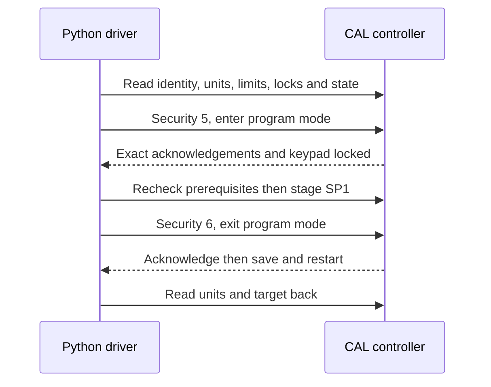

# CAL protocol: evidence and implemented subset

[Hardware tutorial](hardware.md) · [Driver source](../src/tark_chiller/serial.py)

## Sources and controller identification

| Source | What it establishes |
| --- | --- |
| User-supplied `MRC150_300_chiller_user_manual.pdf`, Tark Rev 13, 18 pages | MRC limits, DH2 interface and panel behavior; p14 delegates controller details and does not name its model |
| [CAL 3300/9300/9400 operating manual](https://www.west-cs.com/assets/Manuals/CAL3300-9300-9400-Manual-English.pdf) | Similar keys/menu names and controller settings; similarity is not installed-model proof |
| [CAL communications installation guide](https://www.west-cs.com/assets/Manuals/CAL-3300-9300-9400-9500-Communications-Manual-English.pdf) | Level C, framing and default 9600/8N1; retrofit boards may default to 1200 |
| [CAL Modbus guide](https://www.west-cs.co.uk/assets/Manuals/CAL3393949500-Modbus-Document.pdf), issue 1.10, 7 September 2000, Doc 33034 Iss 002 | Register map, security sequences, units, CRC and response handling |
| [Manufacturer's CAL 3300 page](https://www.west-cs.co.uk/products-uk/models-uk/3300-single-loop-controller-uk/) | Optional RS-232 / RS-485 Modbus RTU |
| [Modbus serial specification V1.02](https://modbus.org/docs/Modbus_over_serial_line_V1_02.pdf), §2.5.1 | RTU framing and silent interval |

Supplied MRC PDF SHA256:
`a60573b85faaa589b6d46e5ba4e5c373ed59c6884e54dfa14ea48a3f11d25df1`.
This replaces the provisional **16-page Laird-branded** copy used earlier. Both say
Rev 13 but have different pagination. Historical records preserve the distinction.
The manufacturer manuals are linked, not redistributed.

**Actual installed controller: unconfirmed.** `Cal33xx` is a candidate for a human
who has identified a CAL 3300/9300. It is not an automatically selected MRC driver.
Model codes 1/2/3 denote 3300/9300 output configurations; firmware codes
`FFFF` or `1` denote 391 and `2` denotes 392. Other identities are refused.

## Commands implemented

References use the CAL guide's **printed pages** (PDF page = +1). Addresses are
the map's hexadecimal addresses sent directly; no 4xxxx prefix or register-number
offset is added. Reads request one item only.

| Purpose | Function / address | Interpretation | Source |
| --- | --- | --- | --- |
| Model / firmware | FC03 `04FC` / `04FD` | Supported identity codes above | pp3,7 |
| Input / unit | FC03 `0198` / `0199` | Require RTD=10 and Celsius=1 | p6 |
| Measured temperature | FC03 `001C` | Tenths of °C, regardless of panel units | pp3,16 |
| SP1 target | FC03 / FC06 `007F` | Tenths of panel units; candidate requires °C | pp3,18 |
| Scale limits | FC03 `0096` / `0094` | Lo.SC / Hi.SC, tenths of panel units | p6 |
| Target lock / resolution | FC01 `0028` / `002A` | SP.LK; DISP low=0 / high=1 | pp5–6 |
| Initialization lock | FC03 `0125` | Require mask `0x02` already set; never unlock automatically | p4 |
| Display / ramp | FC03 `0306` / `0305` | Raw codes and display diagnosis; FAIL invalidates temperature | p4 |
| Enter remote programming | FC06 `0300=5`, then `1500=0` | Locks panel keys; busy exception if menu in use | pp9–10,17 |
| Commit target | FC06 `0300=6`, then `1600=0` | Saves settings, unlocks and restarts controller | pp10,18 |

Only target/control prerequisites are implemented. Alarm configuration, tuning,
sensor selection, unit changes, calibration, initialization-unlock, reset and
power-off operations are not exposed. No coolant/flow/leak sensor map is claimed.

Published PV exchange (CAL p16; address 1, **not an installation default**):

```text
request  01 03 00 1C 00 01 45 CC
reply    01 03 02 00 C4 B9 D7   -> 196 / 10 = 19.6 °C
```

CRC is checked low-byte first. Replies must match slave, function, count and write
echo; exceptions, truncation and trailing bytes fail the transaction. Frames are
sent in one write with at least 3.5 character times between transactions. Windows
and USB buffering cannot prove on-wire timing in software-only tests.
RTU replies do not echo register addresses or carry transaction IDs: CRC cannot
establish the freshness of an otherwise valid delayed response.

## Write contract



Every frame is attempted once. Application coolant bounds and controller
Lo.SC/Hi.SC both apply; firmware does not validate remote values for the host.
`DISP` determines 0.1/1 °C resolution. Writes require initialized, unlocked,
ordinary control mode, no active ramp/soak and exact reviewed identity.
Checks run again after keypad lock to catch local changes during preflight.
No other program may control the unit concurrently.

An error/interruption after the first write latches the session uncertain,
including readback failure after commit. A cleanup exit could apply a staged
target, so none is sent. The guide suggests retries; this project deliberately
uses the stricter no-replay policy from PROJECT.md.

**Candidate scope:** RTD / Celsius, nonnegative returned temperatures up to 400 °C,
targets 0–40 °C intersected with application bounds (default 2–40 °C).
The source does not explicitly specify negative wire encoding; negative values
are refused rather than assuming a representation. Fahrenheit and other CAL
models require separate review. The read range is a parser limit, not a safe
operating region.

## Simulator scope and validation

`CalSimulator().device()` supplies a `SerialDevice` with an in-memory endpoint.
It processes the same RTU frames, security ordering, staged targets, commits,
busy/errors and selected status registers. A staged value changes control only
after exit-program; serial close leaves modeled control running. Initial target
is the MRC manual's 10 °C, with synthetic liquid temperature 20 °C and a 30 s
exponential time constant. These dynamics are not measured cooling behavior.

It does not model electrical signals, flash wear, real restart delay, full
firmware, PID tuning, sensor calibration, flow or thermodynamic capacity.
It shares CRC code with the driver; independent published vectors in
[tests/test_cal.py](../tests/test_cal.py) check that code. Other tests assert
literal addresses and all five write stages, prevent retries, and exercise the
protocol through CSV/GUI. Human tests must compare DISP, SP.LK, initialization,
target persistence, timing and panel behavior on the unit.
