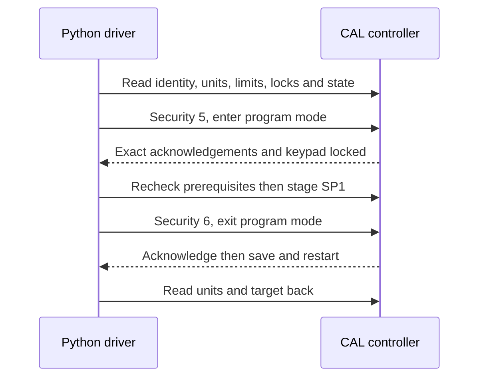

# CAL and T255P protocols: evidence and implemented subsets

[Hardware tutorial](hardware.md) · [Protocol source](../src/tark_chiller/protocols.py) · [Serial owner](../src/tark_chiller/controller.py)

The CAL subset below is retained. [T255P](#thermotek-t255p-rev-c) is a separate
explicitly selected protocol, not an alternate CAL address or serial setting.

## Sources and controller identification

| Source | What it establishes |
| --- | --- |
| User-supplied `MRC150_300_chiller_user_manual.pdf`, Tark Rev 13, 18 pages | MRC limits, DH2 interface and panel behavior; p14 delegates controller details and does not name its model |
| [CAL 3300/9300/9400 operating manual](https://www.west-cs.com/assets/Manuals/CAL3300-9300-9400-Manual-English.pdf) | Similar keys/menu names and controller settings; similarity is not installed-model proof |
| [CAL communications installation guide](https://www.west-cs.com/assets/Manuals/CAL-3300-9300-9400-9500-Communications-Manual-English.pdf) | Level C, framing and default 9600/8N1; retrofit boards may default to 1200 |
| [CAL Modbus guide](https://www.west-cs.co.uk/assets/Manuals/CAL3393949500-Modbus-Document.pdf), issue 1.10, 7 September 2000, Doc 33034 Iss 002 | Register map, security sequences, units, CRC and response handling |
| [Manufacturer's CAL 3300 page](https://www.west-cs.co.uk/products-uk/models-uk/3300-single-loop-controller-uk/) | Optional RS-232 / RS-485 Modbus RTU |
| [Modbus serial specification V1.02](https://modbus.org/docs/Modbus_over_serial_line_V1_02.pdf), §2.5.1 | RTU framing and silent interval |

Supplied MRC PDF SHA256:
`a60573b85faaa589b6d46e5ba4e5c373ed59c6884e54dfa14ea48a3f11d25df1`.
Page references here apply to this 18-page copy, not the 16-page Laird-branded
Rev 13 manual with different pagination.
The manufacturer manuals are linked, not redistributed.

**Actual installed controller: unconfirmed.** `Cal33xx` implements a subset for a human
who has identified a CAL 3300/9300. It is not an automatically selected MRC driver.
Model codes 1/2/3 denote 3300/9300 output configurations; firmware codes
`FFFF` or `1` denote 391 and `2` denotes 392. Other identities are refused.

## Commands implemented

References use the CAL guide's **printed pages** (PDF page = +1). Addresses are
the map's hexadecimal addresses sent directly; no 4xxxx prefix or register-number
offset is added. Reads request one item only.

| Purpose | Function / address | Interpretation | Source |
| --- | --- | --- | --- |
| Model / firmware | FC03 `04FC` / `04FD` | Supported identity codes above | pp3,7 |
| Input / unit | FC03 `0198` / `0199` | Require RTD=10 and Celsius=1 | p6 |
| Measured temperature | FC03 `001C` | Tenths of °C, regardless of panel units | pp3,16 |
| SP1 target | FC03 / FC06 `007F` | Tenths of panel units; driver requires °C | pp3,18 |
| Scale limits | FC03 `0096` / `0094` | Lo.SC / Hi.SC, tenths of panel units | p6 |
| Target lock / resolution | FC01 `0028` / `002A` | SP.LK; DISP low=0 / high=1 | pp5–6 |
| Initialization lock | FC03 `0125` | Require mask `0x02` already set; never unlock automatically | p4 |
| Display / ramp | FC03 `0306` / `0305` | Raw codes and display diagnosis; FAIL invalidates temperature | p4 |
| Enter remote programming | FC06 `0300=5`, then `1500=0` | Locks panel keys; busy exception if menu in use | pp9–10,17 |
| Commit target | FC06 `0300=6`, then `1600=0` | Saves settings, unlocks and restarts controller | pp10,18 |

Only target/control prerequisites are implemented. Alarm configuration, tuning,
sensor selection, unit changes, calibration, initialization-unlock, reset and
power-off operations are not exposed. No coolant/flow/leak sensor map is claimed.

Published PV exchange (CAL p16; address 1, **not an installation default**):

```text
request  01 03 00 1C 00 01 45 CC
reply    01 03 02 00 C4 B9 D7   -> 196 / 10 = 19.6 °C
```

CRC is checked low-byte first. Replies must match slave, function, count and write
echo; exceptions, truncation and trailing bytes fail the transaction. Frames are
sent in one write with at least 3.5 character times between transactions. Windows
and USB buffering cannot prove on-wire timing in software-only tests.
RTU replies do not echo register addresses or carry transaction IDs: CRC cannot
establish the freshness of an otherwise valid delayed response.

## Write contract


```mermaid
sequenceDiagram
    participant P as Python driver
    participant C as CAL controller
    P->>C: Read identity, units, limits, locks and state
    P->>C: Security 5, enter program mode
    C-->>P: Exact acknowledgements and keypad locked
    P->>C: Recheck prerequisites then stage SP1
    P->>C: Security 6, exit program mode
    C-->>P: Acknowledge then save and restart
    P->>C: Read units and target back
```

Every frame is attempted once. Application coolant bounds and controller
Lo.SC/Hi.SC both apply; firmware does not validate remote values for the host.
`DISP` determines 0.1/1 °C resolution. Writes require initialized, unlocked,
ordinary control mode, no active ramp/soak and exact reviewed identity.
Checks run again after keypad lock to catch local changes during preflight.
No other program may control the unit concurrently.

An error/interruption after the first write latches the session uncertain,
including readback failure after commit. A cleanup exit could apply a staged
target, so none is sent. The guide suggests retries; this project deliberately
uses a stricter no-replay policy to avoid applying an uncertain target twice.

**Supported scope:** RTD / Celsius, nonnegative returned temperatures up to 400 °C,
targets 0–40 °C intersected with application bounds (default 2–40 °C).
The source does not explicitly specify negative wire encoding; negative values
are refused rather than assuming a representation. Fahrenheit and other CAL
models require separate review. The read range is a parser limit, not a safe
operating region.

## Simulator scope and validation

`CalSimulator().chiller()` supplies a disconnected `TarkChiller` whose serial
factory returns the in-memory CAL endpoint. The same production protocol and
transaction methods run for simulation and hardware.
It processes the same RTU frames, security ordering, staged targets, commits,
busy/errors and selected status registers. A staged value changes control only
after exit-program; serial close leaves modeled control running. Initial target
is the MRC manual's 10 °C, with synthetic liquid temperature 20 °C and a 30 s
exponential time constant. These dynamics are not measured cooling behavior.

It does not model electrical signals, flash wear, real restart delay, full
firmware, PID tuning, sensor calibration, flow or thermodynamic capacity.
It shares CRC code with the driver; independent published vectors in
[tests/test_cal.py](../tests/test_cal.py) check that code. Other tests assert
literal addresses and all five write stages, prevent retries, and exercise the
protocol through CSV/GUI. Human tests must compare DISP, SP.LK, initialization,
target persistence, timing and panel behavior on the unit.

## ThermoTek T255P Rev C

Source: [T255P user manual, section 16, printed pp23-29](https://neurophysics.ucsd.edu/Manuals/ThermoTek/T255P_chiller_manual.pdf).
SHA256: `7d03254bccf76f528b2df13c0d704ac4a5e62a1a040a08935b4acc07a2d93232`.
There are 35 PDF pages; the printed page number is the one-based PDF page +1.
The command table and signed formats were also inspected visually. The manual is
linked, not redistributed.

### Bench evidence and limits

The following records describe the COM9 setup on 21 October 2026. They are
local acquisition files under ignored `outputs/`, not packaged release artifacts.
They do not establish behavior on other units, firmware, adapters or operating systems.

Manual review against the October 21 bench trace: section 16.2 (printed p24)
allows the next command after a complete response, or after 3 s without one.
It specifies no fixed 100 ms delay after a successful response; no such delay is
enabled in the driver or dashboard. Section 16.1.4 assigns receive readiness to
XON/XOFF, which remains enabled. The command table (printed p28) confirms the
literal requests `.U83\r`, `.J78\r`, `.I77\r` and `.H0A6\r`.

The supplied trace contains valid replies to those requests, followed by
`TX .U83\r / RX #i2BE\r`. The response checksum is valid and its error digit 2
means Bad Command (section 16.2.2, printed p25). Lowercase `i` is absent from the
command table. The manual does not explain that anomalous echo. An on-device
A/B/A test isolated the trigger to the host's repeated timeout assignments:

| COM9 diagnostic, 21 October 2026 | Transactions | Bad-command replies | Port configurations |
| --- | ---: | ---: | ---: |
| Original dynamic timeouts | 51 | 5 | 246 |
| Fixed timeouts | 120 | 0 | 1 |
| Original dynamic timeouts restored | 60 | 5 | 291 |

All phases sent the same U/J/I/H requests at one poll per second with the same
9600/8N1/XON/XOFF settings. In pySerial 3.5 on Windows, assigning `timeout` or
`write_timeout` on an open port invokes `_reconfigure_port()`, including
`SetCommState`, even for an unchanged timeout. See the primary
[timeout setters](https://github.com/pyserial/pyserial/blob/v3.5/serial/serialutil.py)
and [Windows implementation](https://github.com/pyserial/pyserial/blob/v3.5/serial/serialwin32.py).
The driver now sets both timeouts before opening and checks the overall deadline
without changing live port settings. The A/B/A evidence establishes the host
trigger on this setup; the exact UART/firmware mechanism producing lowercase `i` was not measured
electrically. Raw trace: `outputs/communication_ab_20261021T200006Z.jsonl`.

The corrected production controller then completed 120 one-second monitoring
polls on COM9 in 120.3 s: zero failed polls, one port open/configuration, successful
CSV recording and dashboard snapshot rendering, and clean serial shutdown.
Only U/J/I/H were permitted by the diagnostic; no target changes were sent.
Recording: `outputs/communication_fixed_20261021T200211Z.csv`.

The operator reported successfully running standalone mode notebook 05 on
21 October 2026. This is a separate report from the retained read-only traces;
the new `TarkChiller.set_mode()` and dashboard mode callbacks have software
validation only. CAL hardware, target writes, thermal accuracy/settling, physical
flow, fault response and long-duration watchdog/recovery timing remain unverified
by these records. No hardware was contacted during this documentation review.

### Notebook 05 repeated-RUN incident

Notebook 05 incident, 28 October 2026: the operator reported that the chiller was
already running. The saved cell output inspected during the incident contained this exchange,
recorded here as evidence:

```text
TX .U83<CR>     RX #U0001069<CR>  (AUTO START, no summary alarm, chiller on, dryer off)
TX .J78<CR>     RX #J0000000BD<CR> (all six alarms inactive)
TX .G1A6<CR>    RX #G31CE<CR>     (communication error 3: qualifier out of bounds)
```

These frames have valid checksums. G1 is the documented RUN request; the trace
does not establish why this unit rejected it. In particular, its initial U reply
retained AUTO START despite the manual's stated transition to RUN. Unit firmware
and the response to a genuine stopped-to-running transition were not established
by this trace. It is evidence for this setup, not a general rule that duplicate G
commands fail on every T255P.

Example 05 and `set_mode()` now avoid a redundant G when the reported state
already satisfies the requested operation. AUTO START with chiller-on=True
satisfies RUN without changing the reported mode label. STANDBY requires the
STANDBY mode and chiller-on=False. Otherwise the existing G/U verification still
applies. The state-aware `set_mode()` owns this handling; there is no separate
mode-change wrapper. Error 3 is never ignored or retried. This correction has software regression coverage using the retained
frames; it has not been rerun on hardware by the assistant.

### Implemented wire contract

- RS-232 at 9600 baud, 8 data bits, no parity, one stop bit, XON/XOFF enabled.
  Hardware flow control and RS-485 mode are refused before endpoint creation.
- Requests: `.` + command + qualifiers + two ASCII hex checksum characters + CR.
  Responses: `#` + command echo + communication-error digit + data + checksum + CR.
  The checksum is the low eight bits of the sum before the checksum, including
  the start character. Printable ASCII, exact field shapes, checksum, command
  echo, communication error and trailing bytes are checked.
- Error codes 1/2/3 mean checksum/bad-command/out-of-bounds qualifier. Any nonzero
  or unknown code fails closed. A partial/malformed reply is not a measurement.
- One transaction at a time. Default response budget is 3 s per frame; an
  incomplete/invalid frame preserves a 3 s quarantine from request start before
  another command on the same controller, even across close/reopen and with a shorter
  custom timeout. The input buffer is discarded before the next request.

| Purpose | Request | Response data after command/error | Interpretation |
| --- | --- | --- | --- |
| Startup/session/status | U | mode, summary alarm, chiller-on, dryer-on | Mode 0 AUTO START, 1 STANDBY, 2 RUN, 3 SAFETY DEFAULT; remaining flags 0/1 |
| Temperature | I | sign + four decimal digits | Signed hundredths of °C |
| Target / maximum power | H, qualifier 0 | `0` + sign/three digits + comma + three power digits | Target in tenths of °C; power field validated but not exposed as calibrated watts |
| Alarm flags | J | Six binary ASCII flags | Float switch, high temp, low temp, sensor, EEPROM, watchdog |
| Set target | M, sign/three digits | Echoed sign/three digits | 0.1 °C; driver allows water targets 5-45 °C only |
| Set mode | G, qualifier 0 or 1 | Echoed qualifier | 0 STANDBY; 1 RUN; subsequent U reports mode 1 or 2 respectively |
| Select sensor | O, qualifier 0 or 1 | Echoed qualifier | 0 INTERNAL; 1 EXTERNAL; no independent sensor-mode query is documented |

T255P getters and target/sensor setters send one command: I for
`get_temperature()`, H0 for `get_memory()`, J for `get_alarms()`,
U for `get_status()`, M for `set_setpoint()`,
O for `set_sensor_mode()`. These methods never implicitly handshake,
retry, reconnect or query independent readback. `set_mode()` owns the RUN/STANDBY
state request: U check, conditional G and U verification. No command is retried.
`get_memory()` retains the raw
maximum-power setting. U fields and J flags are structured dictionaries.
`collect_status()`, `read_temperature()`, `read_setpoint()` and `apply_setpoint()`
are the other explicit workflows; see the [API](api.md).

Published startup vector (printed p27):

```text
request: 2E 55 38 33 0D                       .U83<CR>
reply:   23 55 30 32 30 31 31 36 43 0D       #U020116C<CR>
```

The reply represents RUN, no aggregate alarm, chiller on and dryer on. It is a
published example, not an expectation that the actual T255P has a running dryer.
The manual's 29.5 °C target encodes as `+295`, and -5.0 °C as `-050`.
Signed reads are implemented; sub-zero writes are deliberately not enabled.

### Session ownership and write behavior

`T255P()` is read-only; `T255P(allow_writes=True)` explicitly enables target
mode and sensor-selection requests. It does not claim remote model identification. The lab script selects
the actual model and supplies a source-backed 5-45 °C water profile. CAL uses its
separate, unchanged protocol and application policy.

Connection sends U. Checked read/write workflows and monitor polls start with U,
so idle expiry and read reconnection re-establish the documented session.
Single-command methods require an established session; after idle expiry the
caller must explicitly issue U (for example `get_status()`) or choose a workflow.
The manual describes AUTO START changing to RUN on the first watchdog exchange;
the October 28 trace above reports AUTO START with the chiller on instead.
`set_mode()` checks U and skips G if the desired operation is already
satisfied; otherwise it sends G, then validates its qualifier echo and U
mode/chiller-on readback. Alarm flags do not veto either request; the device must
report the requested mode/on state for success. Both require write opt-in. A failed/interrupted G latches
the controller closed across reconnect; requests are never replayed. The driver
never sends G during connection, monitoring, disconnect or GUI shutdown. It sends
no O (sensor selection), startup target or automatic rollback during those operations.
Only an explicit `set_sensor_mode()` sends O, with write opt-in and qualifier-echo
validation. O has no documented independent readback. A failed/interrupted O
latches the controller closed across reconnect and is never replayed.
The `apply_setpoint()` workflow sends U, one M, checks the echoed value, and checks a
subsequent H readback. It permits target changes in any reported mode and with
reported alarms, without sending a mode change. Neither write path queries J.
Any failure/interrupt after starting M in this workflow latches the port closed,
including across reconnect. The M/O command setters retain the latch through
their acknowledgement echo only; `set_mode()` retains it through U readback
after G. No write is retried. A standalone `get_temperature()`
only decodes I; sensor alarm makes the checked temperature workflow unavailable;
other alarm flags remain reported diagnostics, not proof of safe conditions.

There is no alarm-clear command in the documented serial interface. J only reads
flags; changing a target or requesting RUN does not promise to clear them. For
the startup low-coolant alarm, the manual's section 5 instructs the operator to
add coolant as needed and press the front-panel Run/Standby key. Other alarms
require addressing their reported cause (section 6).

The manual calls for a valid command every five seconds, and returns local control
after more than ten seconds without valid traffic while preserving run/standby.
Normal one-second monitoring supplies this traffic through the existing explicit
worker. **There is no independent keepalive worker or guaranteed remote lease.**
Stopping monitoring, an idle synchronous application, a process stall or a fault
may allow local-control return. The next workflow sends U again; single-command
callers must explicitly renew with a U getter. `is_connected`
means an open usable software transport, not continuing remote ownership.

A valid delayed reply to the same command cannot always be distinguished from
fresh data: this protocol has no transaction identifier. Quarantine and buffer
clearing reduce ambiguity; they do not prove on-wire timing or freshness. Host/OS
calls and USB buffering are not hard real-time. A failed write still needs human
inspection regardless of the apparent reply. A new process cannot retain a
previous process's in-memory quarantine; human recovery must allow at least the
manual's response interval before a new connection.

For checked read/monitor workflows, when bounded read recovery is enabled, a checksum-valid reply with communication
error 1/2 (checksum/bad command), or error zero but echoing a different command,
is discarded and triggers close/quarantine/reopen plus a new U handshake.
Nonzero device errors take precedence over echo checking.
The entire read-only poll is retried with fresh checks; no mismatched payload is
accepted. Retry reasons and raw rejected frames are logged. A failed reply checksum,
data-format error, sensor fault or qualifier/unknown error still suspends recovery. Write
sequences are never replayed, including on a wrong-command acknowledgement.
When monitor read retries are exhausted, the failed poll is recorded and the
next interval attempts a fresh connection. CSV and monitoring remain active;
an intermittent link error does not latch a permanent monitoring stop.

T255P polling retains independently validated fields from the final read attempt
if a later query fails. For example, a valid I temperature followed by an H
failure retains the temperature and leaves setpoint unavailable. The poll still
fails and the connection closes; the GUI labels the retained temperature
as historical. Partial fields are cleared before every recovery attempt.

### Simulator scope

`T255PSimulator` accepts production frames and models AUTO START/RUN/STANDBY,
U establishment, valid-traffic watchdog reset, local return after >10 s, repeated
startup/expired-session XON, XON/XOFF filtering and paused-output write timeout.
It retains targets over a synthetic power cycle and continues modeled control
when the serial endpoint closes. G models explicit production RUN/STANDBY calls
and the standalone serial example. O models sensor selection and echo only;
it does not model an external sensor or its effect on regulation.

Synthetic choices: initial liquid and retained target 20 °C, 30 s exponential
response, max-power field 100, dryer off, initially clear alarms, and instantaneous
command application. The manual supports the 20 °C factory target, but no thermal
model or error-clearing policy is physically established. Standby pauses modeled
thermal evolution; real passive heat transfer is omitted. Only sensor alarm's
specified standby behavior is modeled; arbitrary alarm onset/clearing, safety-
default physics, EEPROM durability, electrical lines, OS flow control and timing
are not validated. Simulator agreement is supplemented by literal manual vectors
and independently constructed malformed/data fixtures in tests/test_t255p.py.
