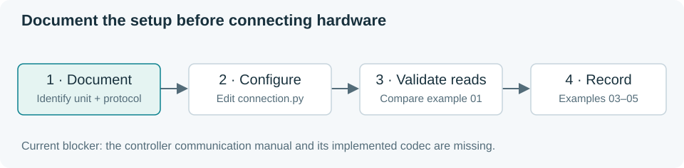

# Quick start

[Home](../README.md) · [API](api.md) · [Troubleshooting](troubleshooting.md)

You need Python 3.12+ and a copy of this project. The simulator needs no chiller,
cable or serial adapter. Commands below use Windows PowerShell.



## 1. Install the driver

Open PowerShell in the folder containing `pyproject.toml`.

```powershell
python --version
```

Stop if the version is older than 3.12. Select a supported Python installation,
reopen PowerShell and check again. Then:

```powershell
python -m venv .venv
.\.venv\Scripts\python -m pip install .
.\.venv\Scripts\python examples/01_read_temperature.py
```

Expect `Temperature: 20.00 Celsius`, a 20.00 Celsius target and simulator status.
Use this environment's Python for later commands; activation is unnecessary.

## 2. Read and set a target

```powershell
.\.venv\Scripts\python examples/02_set_temperature.py
```

The reported target becomes 18.00 Celsius. Temperature changes gradually.
Each new simulator starts at 20 °C. The default allowed target range is 2–40 °C.

## 3. Record data

```powershell
.\.venv\Scripts\python examples/03_log_temperature.py
```

After about five seconds, the script reports its row count. Open
`outputs/03_temperature.csv` in a text editor or spreadsheet. Expect UTC times,
Celsius readings and a simulator label. Existing filenames are refused.

To record until Ctrl+C without a browser:

```powershell
.\.venv\Scripts\python -m tark_chiller --headless --csv outputs/experiment.csv
```

For a short timed run:

```powershell
.\.venv\Scripts\python -m tark_chiller --headless --duration 5 --interval 0.2 --csv outputs/timed.csv
```

## 4. Add the optional dashboard

```powershell
.\.venv\Scripts\python -m pip install -c requirements-tested.txt ".[gui]"
.\.venv\Scripts\python -m tark_chiller --csv outputs/dashboard.csv
```

Open [127.0.0.1:8050](http://127.0.0.1:8050). Check the **simulator** label,
temperature and recording status. Enter **18** and apply the target. The target
line changes first; the temperature curve approaches it.

Try **1** to see a rejected target. Requests must stay within the displayed
2–40 °C limits. Closing the tab leaves acquisition running. Stop with
**Ctrl+C in its terminal** to join monitoring and close CSV.

Continue with the [dashboard tour](usage.md#dashboard-tour) or [API](api.md).
Real devices still need the [missing protocol and physical validation](hardware.md).
