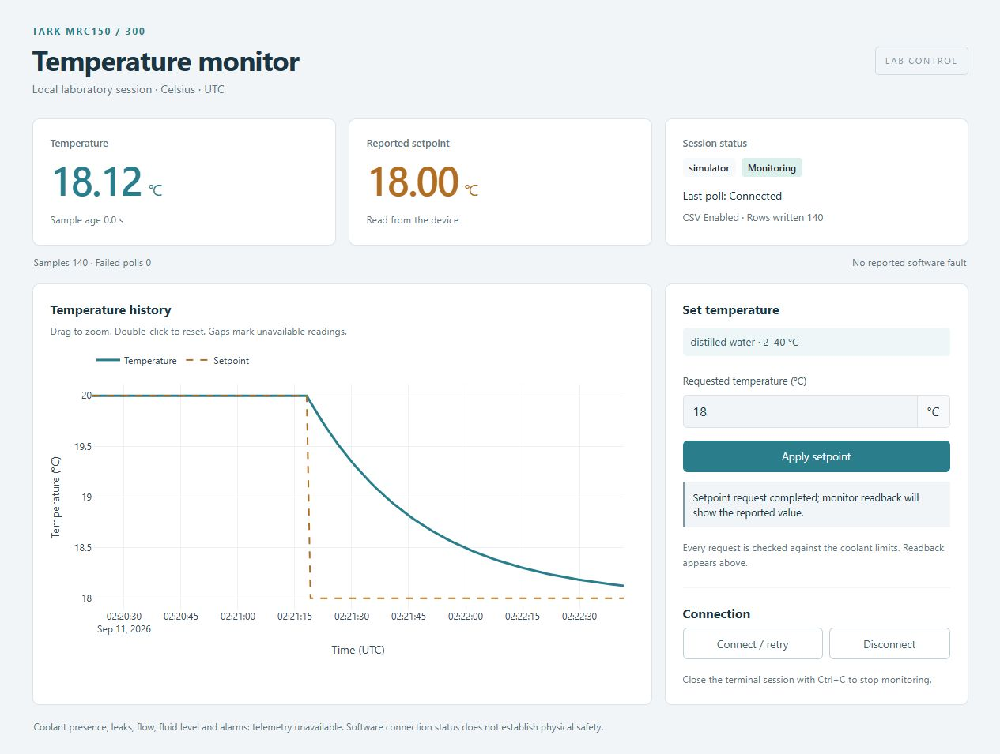

# Dashboard and recording

[Home](../README.md) · [Quick start](quickstart.md) · [Python API](api.md)

The dashboard is optional. The driver and monitoring work in ordinary scripts
without Dash, Bootstrap or Plotly.

## Dashboard tour

The display shows temperature, reported target, connection/fault information,
sample age and recording status. Enter a Celsius target and apply it once.
The next reading confirms the target; a successful request does not mean the
liquid has reached it.

The graph shows temperature and target versus time. Drag to zoom, double-click
to reset, or select a legend entry to hide/show a trace. Missing readings leave
gaps. Stale data is marked rather than presented as a live reading.

The host owns connection and monitoring. There are no GUI connection or
monitor-start buttons. Closing or refreshing a page neither stops nor creates
acquisition workers. End the run with **Ctrl+C in the launching terminal**.

## CSV recording

Supply `--csv outputs/run.csv` to the launcher or `csv_path="run.csv"` to
`chiller.start_monitoring()`. Omit the path to monitor without recording.

Each run creates a new file. Existing filenames are refused; there is no append
or automatic overwrite mode.

| Column | Meaning |
| --- | --- |
| `timestamp_utc` | Poll start time in UTC |
| `elapsed_s` | Seconds since this monitoring run began |
| `temperature_c`, `setpoint_c` | Celsius measurement and reported target; blank on failed polls |
| `backend`, `connected` | Backend label and poll connection state |
| `status` | Device/connection detail |
| `error` | Poll failure, or blank |

The worker flushes each row for readers. Flushing is not a power-loss guarantee.
If writing fails, `logging_error` reports it and recording stops; acquisition
can continue in the API and GUI. The headless launcher stops and exits with
the error so unattended recording cannot fail silently.
`stop_monitoring()` waits for polling and closes CSV.
`disconnect()` performs this cleanup too.

## Simulator behavior

Each new `Simulator()` starts at 20 °C with a 20 °C target. Temperature approaches
a new target gradually. Disconnect pauses its model; reconnecting that same
object resumes its previous temperature/target without a new write.

The model is uncalibrated. It does not predict chiller speed, cooling capacity,
fluid dynamics or physical safety conditions.

## Safe temperature changes

The default distilled-water range is **2–40 °C**, from the public MRC manual's
page 7 table. Each request is checked in the driver before backend access.
Use numeric Celsius values; the software does not infer units.

Custom coolant bounds need a documented source. Software cannot identify coolant,
detect leaks or prove sub-zero operation is safe. Controller acceptance does not
prove suitability. The [hardware guide](hardware.md) separates verified facts,
missing protocol information and physical validation.
