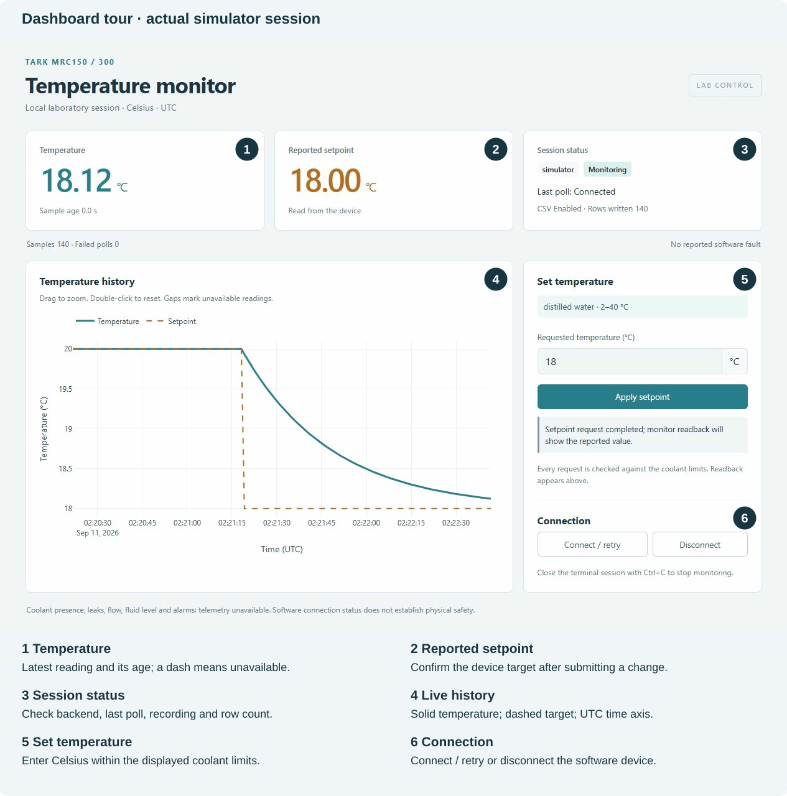

# Dashboard and CSV guide

[Home](../README.md) · [Quick start](quickstart.md) · [Python API](api.md) · [Hardware](hardware.md)

The supplied launcher always uses the simulator. It starts at 20 °C and moves
gradually toward your target. Restarting the app resets it. Disconnect/reconnect
within a running app pauses/resumes the simulation with the same target.

## Dashboard tour

| Area | How to use it |
| --- | --- |
| Temperature | Latest Celsius reading and sample age. A dash means no fresh reading. |
| Reported setpoint | Target read from the device. Check here after submitting a new target. |
| Session status | Backend, monitoring state, last connection result and CSV rows written. |
| Fault messages | Read the specific error. “No reported software fault” does not prove physical safety. |
| Temperature history | Solid temperature and dashed target, with UTC time. Hover for values, drag to zoom, double-click to reset; the graph toolbar can export a PNG. |
| Set temperature | Enter a numeric Celsius target within the displayed profile, then Apply setpoint. |
| Connection | Disconnect closes the software connection; Connect / retry reconnects it. Monitoring continues during an intentional disconnect and records unavailable rows. |

A **poll** is one attempt to read the device. Each poll produces a **sample**:
readings and a timestamp, or an error. Last poll describes that attempt, not an
instantaneous connection check. Stale means a new sample is overdue. Stale or
stopped monitoring hides the live card values; the graph keeps historical data.

The plot keeps the latest 3,600 samples by default. Reloading or closing the browser
does not stop monitoring. Press **Ctrl+C in the terminal** to stop the application.
Connect / retry cannot restart a stopped monitoring thread; resolve its error and
restart the app. See [troubleshooting](troubleshooting.md).

## CSV recording

Launch with `--csv outputs/session.csv` and use a fresh filename for each run.
**CSV Enabled** means recording is configured. **Rows written** counts completed
rows in this recording session, including error rows. **Off** means recording was
not enabled. **Failed** means a file error stopped recording; monitoring can continue.

Use `--append-csv` to add a new session to an existing, undamaged file. The app
checks every row and the column names before writing. It refuses incomplete or
corrupt files unchanged. Only one CsvLogger can write to a file at a time.
Each row is flushed for readers, but power loss can still lose data.
The launcher handles Ctrl+C and cooperative termination signals. A forced OS
kill (including Windows `TerminateProcess`) bypasses Python cleanup; use Ctrl+C
and wait for the terminal to report that the simulator stopped.

| CSV field | Meaning |
| --- | --- |
| session_id | New ID for each recording session, including append runs |
| timestamp_utc | UTC date/time at the start of the poll |
| elapsed_s | Seconds since this monitor was created |
| temperature_c / setpoint_c | Celsius values; blank for failed polls |
| backend / connected | Device type and whether that poll succeeded |
| status_detail / error | Status or error text; no error text on successful polls |

**Expected output:** example 03 creates five rows with temperature/setpoint 20 °C,
backend `simulator`, `connected=True`, and blank error fields. Example 04 sets an
18 °C target, records roughly 20 rows over ten seconds, and shows gradual cooling.
Exact sample counts and timestamps depend on scheduling. Each rerun needs a new
filename or an explicit append choice.

CSV contains no coolant, flow, level or leak measurements. If recording fails,
read the error, fix storage, stop the app and begin a new recording. Preserve any
damaged file for investigation. [Numbered examples](../README.md#five-examples)
show both manual sampling and background monitoring with error checks.

## Safe temperature changes

A setpoint is a target, not an immediate temperature change. Every write is checked
before device access. The default distilled-water limits are **2–40 °C**, including
both endpoints. Enter **18** to try cooling; **1** is rejected. Numeric values
always mean Celsius, with no Fahrenheit/Kelvin conversion.

Python calls also reject strings, booleans, NaN and infinity. Other coolants need
an explicit, documented `CoolantProfile` at both API and device. A profile cannot
identify the installed fluid or prove that a value below 0 °C is safe. The software
never repeats a setpoint write automatically after reconnect.

[Hardware tutorial and manual facts](hardware.md) explain the protocol dependency
and the remaining checks before a physical chiller can be used.
