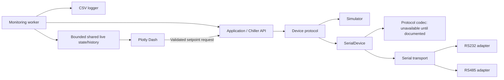

# Engineering records

No project records yet. Append evidence and consequential decisions below as work
occurs. These are durable conclusions and their basis, not a transcript or private
reasoning. STATE.md links directly to the records needed for the current checkpoint.

Use monotonically increasing IDs: `E001`, `E002`, … for evidence; `D001`, `D002`, …
for decisions. Never reuse IDs or overwrite an earlier result to make it pass.
Append a new record for a rerun, correction, or superseding decision and link back.
Keep IDs stable when splitting this file later; update inbound links. Allocate IDs
through the coordinator when agents work concurrently.

Use stable `TEST-001` identifiers for validation procedures and `REQ-001` for
requirements; one test may address multiple requirements and may have many E
records across runs. Link scripts, source, raw data, logs, calculations, manuals,
and configurations rather than embedding large artifacts. Cite relevant manual
sections and versions. Redact secrets before writing any persistent artifact.

## Evidence record format

Copy and fill this format when recording an actual observation. Placeholders and
examples are not evidence. Omit fields only when they are inapplicable, explaining
any material limitation.

```markdown
## E<number>

Date: <timestamp with timezone>
Kind / scope: <test, measurement, inspection, simulation, calibration, human report>
Requirements / test: <REQ IDs; TEST ID and procedure/script link where applicable>
Claim: <narrow statement this observation supports or refutes>
Method: <reproducible command or procedure; inputs, expected result, conditions>
Configuration: <source revision or file hashes; tool/firmware versions; hardware
identity, connections, parameters, and calibration that affect this observation>
Result: <actual values with units, errors, sample counts, and PASS/FAIL/INCONCLUSIVE
against the expected criterion; do not equate command exit status with acceptance>
Artifacts / references: <links to code, logs, raw data, calculations, or docs>
Limitations: <simulation vs physical scope; uncertainty; untested conditions>
Bearing: <effect on requirement status, diagnosis, or next action; previous E IDs>
```

Calibration evidence also states the calibrated quantity, method, reference,
result, uncertainty where meaningful, and validity assumptions. Human-reported
results identify the supplied procedure and result, and their verification limits;
do not describe them as direct agent measurements.

## Decision record format

Record decisions only when their consequences or rationale matter for later work.
Routine edits do not need decision entries.

```markdown
## D<number>

Date: <timestamp with timezone>
Decision: <chosen design, configuration, or diagnostic conclusion>
Basis: <E IDs, source references, or explicit assumptions; affected REQ IDs>
Consequence: <engineering tradeoff, affected interfaces/artifacts, validation needed>
Reconsider if: <new evidence or changed conditions that would invalidate the choice>
Supersedes: <earlier D ID if applicable>
```

## Project records

## E001

Date: 2026-09-10 (America/Chicago).
Kind / scope: initial file and framework inspection; REQ-001 / TEST-001.
Claim: no prior project implementation or manual was available to preserve.
Method: `rg --files --hidden -g '!.git'`; `git status --short`; read all
project and local template content before engineering edits.
Result: only `prompt log.md`; unborn `main` branch. Local template is clean at
`724a7f772069d3357ea66dbc4742d25bd874a33e`, origin matches
[requested repository](https://github.com/cct1123/agentic-engineering-template).
Public repository listing also inspected; remote HEAD was not confirmed because
the initial shell network request failed. No claim that the local commit is latest.
Applied: AGENTS.md and ARCHITECTURE.md unchanged; ledger format preserved;
PROJECT.md, STATE.md, README.md and report adapted. Historical template prompts
and maintainer review are intentionally not imported into this project.
Limitations: attachment not exposed in the conversation, workspace or resource
inventory. No external/private directories were searched for unrelated manuals.

## E002

Date: 2026-09-10 (America/Chicago).
Kind / scope: authoritative online replacement manual review; REQ-003–006, REQ-013.
Source: [MRC150/300 Specification and User Manual, Rev 13, 2024-03-04](https://tark-solutions.com/sites/default/files/fields/media.file.field_media_file/2024-03/MRC150-300-User-Manual.pdf),
16 pages, Laird-branded, Tark-hosted. This is not the unavailable attachment.
SHA-256: `24a64ef551f3e209addfb133a085c353f046ca20421d9f7453b8c9f16f4ca4eb`.
Method: coordinator read complete extracted text; documentation specialist read
all text and visually inspected relevant tables/pages with Poppler. Online source
retrieved to temporary storage; full manual not copied into the repository.

Verified facts (printed page numbers):

- F001, p7: distilled-water control range 2–40 °C; ambient range 4.4–45 °C.
- F002, p7: specified 70% distilled water/30% ethylene glycol range −12–40 °C.
  P11 instead recommends >30% glycol/alcohol below 2 °C; resolve mixture suitability
  before enabling a non-water physical profile.
- F003, p12: separate controller-manufacturer manual supplied with each unit;
  RS232/RS485 mentioned. P4 records removal of DH4 RS485; p7 lists DH2 RS232 only.
  Actual-unit RS485 availability cannot be concluded.
- F004, p12: recommended low limit is coolant freezing point +2 °C. Broad controller
  setting ranges do not define safe equipment operation.
- F005, pp6,11: coolant, airflow clearance, air purging and leak checks are physical
  operating prerequisites. Software cannot verify them from this document.
- F006, pp7,13: physical low-fluid indicator exists; no flow can occur while unlit.
  No serial access to level, flow, leaks, coolant presence or alarms is established.

Result: a bounded search of available inputs and official public sources did not
identify the applicable controller communications manual or exact controller.
EXT-001 remains external; no wire format/settings will be inferred.
Limitations: no unit identification, physical observation or calibration performed.

## D001

Date: 2026-09-10 (America/Chicago), before implementation.
Decision: use one small `src/tark_chiller` package and a synchronous common API,
with an independent background monitor and an optional Dash presentation layer.
Basis: prompt 2, E001–E002, all PROJECT.md requirements.



Module contracts:

- `errors.py`: `ChillerError`, `ChillerConnectionError`, `SetpointValidationError`,
  `ProtocolError`, `ProtocolUnavailableError`, `TransportError`.
- `device.py`: frozen `DeviceStatus(connected: bool, backend: str, detail: str='')`
  and structural `ChillerDevice` with the seven user-facing API operations.
  Status describes software communication/backend only; no invented safety bits.
- `safety.py`: frozen `CoolantProfile(name, minimum_c, maximum_c, source)`,
  `DISTILLED_WATER`, finite real-number validation. Profiles are explicit policy,
  not a coolant detector or a bypass of actual unit limits.
- `api.py`: `Chiller(device, coolant=DISTILLED_WATER)` validates writes before
  backend access, rejects invalid numeric reads, serializes operations with a
  reentrant lock; no startup writes, reconnect replay or automatic write retry.
- `simulator.py`: `SimulatedDevice`, deterministic monotonic-clock thermal model,
  20 °C initial temperature/target; the same device contract as serial backend.
- `protocol.py`: `ProtocolCodec.ensure_available()`, `encode(operation, value=None)`,
  `is_complete(buffer)`, `decode(operation, response)`; default `MissingProtocol`
  raises before any port opens. Operation names are internal API labels, not wire
  commands. No hypothetical Tark protocol will be created even for the simulator.
- `transport.py`: common `open`, `close`, `is_open`, `exchange(request, is_complete)`;
  RS232/RS485 wrappers over injected pySerial instances. All device serial settings
  explicit, including flow control and RS485 mode. Finite positive software timeout
  and response-size budgets bound transactions. Failed exchanges close the link;
  partial or uncertain writes are not resent.
- `hardware.py`: `SerialDevice(transport, codec, coolant=DISTILLED_WATER)` maps the
  seven operations to codec/transport; checks protocol before opening and validates
  again at its write boundary. A custom profile must be supplied consistently to
  both this device and `Chiller`; mismatches can only further restrict writes.
- `monitoring.py`: `Monitor`, immutable sample/snapshot data, `LiveState` with a
  bounded deque and lock. Worker calls the API, writes CSV and publishes samples;
  polling and GUI refresh are independent. A failed poll records blank readings
  and an error; timestamps identify freshness. Read calls are sequential, not an
  asserted atomic hardware snapshot. Stop joins the worker before disconnect.
- `csvlog.py`: context-managed `CsvLogger`; explicit units/UTC/elapsed/backend/error,
  flush per row; failure visible to monitor and UI. No database or pandas.
- `gui.py`: `create_app(chiller, state)` consumes snapshots for plotting/status and
  calls the API only on an explicit setpoint submission; it never starts a worker.
- `__main__.py`: simulator-only entry point owns connect/start/stop/disconnect and
  optional logger; loopback single-process Dash with debug/reloader disabled.

Consequence: protocol replacement is local; API/monitor/CSV/GUI remain unchanged.
Keep generic transport mechanics separate from device semantics, and do not
equate a mock transport with a working hardware driver. No async framework,
plugin system, command queue, database or unneeded directory is introduced.
Reconsider if: real communication documentation requires streaming, multi-frame
transactions, acknowledgements, units negotiation or device-specific startup.
Those findings may refine the boundary through a new decision; do not hide them
inside higher-level application code.

## Validation methods

Hardware-free plan and eventual physical gates follow. Synthetic test byte strings
and serial parameters are fixture data, never Tark configuration examples.

| Method | Scope, procedure and expected result |
| --- | --- |
| TEST-001 | Inspect template core files, prompt log, requirement IDs, links, architecture decision and next action; no placeholder intent or full-system success claim. |
| TEST-002 | `tests/test_api.py`: common interface, disconnected behavior, invalid reads, deterministic dynamics, concurrency, idempotent disconnect, no retry/startup/reconnect write. `tests/test_serial.py` uses the same Chiller facade over a synthetic codec. |
| TEST-003 | API/serial tests: boundaries, out-of-bounds/non-finite/type rejection before backend I/O, explicit provenance, immutable profiles, custom bounds, no inferred sub-zero safety. |
| TEST-004 | Serial tests: MissingProtocol causes zero factory/open/write calls; synthetic codec normalizes operations and rejects malformed values/status. Real response matching awaits EXT-001. |
| TEST-005 | Serial fakes: explicit RS232/RS485 settings, unsupported mode, partial writes, read/write failures, timeout, response budget, cleanup failure and serialization. Expect typed errors, disabled link and no retransmission. |
| TEST-006 | Monitor tests: at least 3 samples at 0.02 s interval within 2 s without Dash; duplicate start idempotent; failed poll blank; explicit reconnect recovers; bounded immutable history; worker/start/stop failures and conservative timestamps visible. |
| TEST-007 | CSV tests: parse before close to verify flush, UTC/units/header/quoting/blank failure values, refuse existing file, simulate disk-full with retained live data and sticky recording error. |
| TEST-008 | GUI tests: connected/stale/error presentation, plot gaps, server-side guards, actual Dash HTTP callbacks; repeated refresh never acquires. Capability text says telemetry unavailable. |
| TEST-009 | Headless subprocess: simulator → API → worker → state/CSV, at least 3 samples. GUI readback test connects simulator/monitor/history to plot. `python -S` proves core/monitor import without Dash/serial. |
| TEST-010 | Editable install, pip check, Ruff check/format, wheel from sdist, wheel-only simulator smoke, dependency snapshot and source hashes. |
| TEST-011 | Browser: live status/two traces; apply 18 °C and observe cooling/readback; reject 1 °C and retain target; page reload preserves history; inspect layout and stop application. |
| TEST-012 | Future physical acceptance after documented codec, reviewed candidate and authorization: identify unit/controller/firmware/interface; verify documented least-consequential read, units and status; approved setpoint/readback, temperature-reference comparison, communication faults and operator shutdown. Exact bytes/tolerances/timings/rollback require protocol, actual setup and calibrated reference. No physical step executed. |

Before hardware readiness, extend short tests with a sustained run and combined
fault injection while GUI is active. Measure cadence, bounded history, file growth,
freshness, recovery and shutdown. Simulation does not establish physical accuracy.

## E003

Date: 2026-09-10 (America/Chicago).
Kind / scope: environment diagnosis; TEST-010 and TEST-007/009 setup.
Observed: bundled Python 3.12.14 created a venv, but restricted Windows temporary
directory permissions prevented ensurepip. An editable install before `src/`
existed also correctly failed metadata generation. No passing result was claimed.
Action: complete scaffold, bootstrap/install in project venv with tool-approved
escalation; global Python unchanged. Restricted monitor/GUI run: 22 passed and 3
temp-directory setup errors; same checks with escalation: 25 passed. Review
regressions are included in E005. No assertions weakened and no hardware accessed.
Version capture: [requirements-tested.txt](../requirements-tested.txt).

## E004

Date: 2026-09-10 (America/Chicago).
Kind / scope: bounded integration review; REQ-007/008/010/012.
Method: core specialist reviewed monitoring/CSV/GUI/lifecycle; coordinator reviewed
serial/protocol integration. Reproduced findings:

1. Timestamp after sequential reads could present an older temperature as fresh.
2. Restart/rejoin retained obsolete service-failure messages.
3. Thread-start failure left running=True and an unstarted thread that could not
   be joined, masking the original error and obstructing cleanup.

Corrections: conservative poll-start timestamp; clear obsolete errors on explicit
restart/successful rejoin; roll back failed startup. Fatal errors persist until
restart; logging errors persist for the run. Added event-synchronized regressions.
Result: independent reviewer checked fixes, no further actionable finding; all
regressions passed in E005. No physical or hard real-time guarantee follows.

## E005

Date: 2026-09-10, approximately 17:10 -05:00.
Kind / scope: final initial automated regression; TEST-002 through TEST-009.
Configuration: Python 3.12.14, Windows, dependency snapshot E003;
[initial source/config hashes](../outputs/initial-source-manifest.sha256).
Method: `.venv\Scripts\python -m pytest -q -p no:cacheprovider --junitxml=outputs\test-results.xml`.
Expected: all hardware-free tests pass; no real serial port constructed/opened.
Result: **PASS — 130 tests, 0 failures, 0 errors, 1.16 s**. Core 50; serial 52;
monitoring/integration 18; GUI 10. [Raw JUnit report](../outputs/test-results.xml).
Limitations: short tests with simulation/fakes; no real MRC, sustained reliability
or cross-platform certification. Physical criteria remain BLOCKED.

## E006

Date: 2026-09-10, approximately 17:09–17:11 -05:00.
Kind / scope: browser integration and visual review; TEST-011, REQ-011/013.
Method: simulator CLI, loopback port 8050, debug/reloader off, in-app browser.
Observed: connected simulator, unknown physical telemetry, UTC/°C axes and two
traces. Applied 18 °C; observed simulated temperature 18.69 °C, target 18.00 °C.
Entered 1 °C; GUI rejected it and retained 18.00 °C. Reload preserved target/history.
Result: PASS in inspected desktop viewport; readable status/controls, curves
visible, no observed clipping. Other viewports remain untested.
Cleanup: Ctrl+C printed `Stopped simulator; 127 samples retained.` PTY exit code
was 1 on interruption without traceback; orderly headless exit/join passed in
E005. Preview process stopped; no physical device involved.

## E007

Date: 2026-09-10, approximately 17:12 -05:00.
Kind / scope: packaging/configuration; TEST-010, REQ-014.
Results:

- `pip install -e ".[gui,serial,dev]"`: PASS in project `.venv`.
- `python -m pip check`: PASS, no broken requirements.
- `python -m ruff check --no-cache src tests`: PASS.
- `python -m ruff format --check --no-cache src tests`: PASS, 17 files formatted.
- `python -m build --no-isolation`: PASS, sdist and wheel built from sdist.
- Wheel-only `python -S` with wheel directly on sys.path: API connects, accepts
  and reads 18 °C, disconnects; PASS with module path inside wheel.

Environment: sandbox denied local listening socket and built-wheel read; approved
escalation enabled checks. `pip freeze` attempted unborn Git HEAD; used `pip list
--format=freeze --exclude tark-mrc-chiller --exclude pip` for exact versions instead.
No commit created merely for metadata. Full snapshot is linked in E003.
Primary references: [Dash callbacks](https://dash.plotly.com/basic-callbacks),
[live updates](https://dash.plotly.com/live-updates),
[pySerial API](https://pyserial.readthedocs.io/en/latest/pyserial_api.html).
Limits: native RS485 depends on platform/adapter; OS open/close and high-level
lock waits are not hard real-time bounded. Dash is single-process, loopback only.

## E008

Date: 2026-09-10 (America/Chicago).
Kind / scope: initialization handoff inspection; TEST-001, REQ-001/014.
Method: inspect root documents, requirements in PROJECT/STATE, module boundaries,
report, prompt log, local Markdown links, unchanged template AGENTS/ARCHITECTURE
and the source/config SHA-256 manifest. No commit exists; hashes identify code.
Result: handoff prepared with all 15 requirements, explicit external dependencies,
manual provenance, architecture decision, tested configuration and precise next
action. PASS: 65 local Markdown links resolve; all 15 IDs present in both matrices;
template guidance matches the source; 19 source/config hashes match; JUnit confirms
130 tests, zero failures/errors. Test-created scratch directories removed.
Scope: initialization/design milestone complete, full hardware project remains
SOFTWARE_DEVELOPMENT. No pending approval or hardware operation.

## E009

Date: 2026-09-10 (America/Chicago).
Kind / scope: review and commit preparation; user prompt 3, TEST-001/006/010.
Review: independent reviewer inspected package and tests; coordinator checked
documentation, ignored artifacts, source hashes and remote. Remote has no branches.
Finding: very large positive intervals exceeded the platform's thread-wait limit,
causing a worker OverflowError; enormous integers could overflow validation itself.
Correction: reject values above threading.TIMEOUT_MAX before numeric conversion,
including stop delays. Three regressions added; no hardware/protocol behavior changed.
Result: **133 tests passed, zero failures/errors, 1.17 s**; Ruff check and format
passed. [Review regression results](../outputs/precommit-tests.xml). No remaining
actionable code-review findings. Physical limitations remain as documented.
Rebuilt source archive/wheel passed; wheel source matches the corrected monitor,
and wheel-only simulator/API plus extreme-timing rejection checks passed.
Reproducibility: added LF text attributes because the local Git configuration uses
autocrlf; normalized dependency-snapshot newlines so staged and checked-out source
hashes remain identical. Current [20-file source/config manifest](../outputs/source-manifest.sha256)
supersedes the initial manifest; E005's original manifest is retained separately.
Authority: prompt 3 explicitly authorizes commit and push to configured origin/main.
No real hardware interaction or hardware-ready approval is implied.
