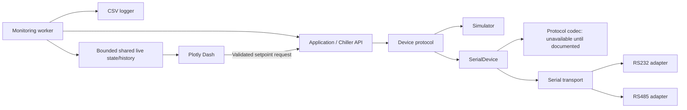

# Engineering records

Evidence and consequential decisions are immutable historical observations; newer
records supersede their applicability, not their contents. Current status belongs
in STATE.md. The coordinator allocates unique E/D IDs and links requirements to
observable test methods. Preserve source provenance and distinguish simulation
from physical validation.

## E001

Date: 2026-09-10 (America/Chicago).
Kind / scope: initial file and framework inspection; REQ-001 / TEST-001.
Claim: no prior project implementation or manual was available to preserve.
Method: `rg --files --hidden -g '!.git'`; `git status --short`; read all
project and local template content before engineering edits.
Result: only `prompt log.md`; unborn `main` branch. Local template is clean at
`724a7f772069d3357ea66dbc4742d25bd874a33e`, origin matches
[requested repository](https://github.com/cct1123/agentic-engineering-template).
Public repository listing also inspected; remote HEAD was not confirmed because
the initial shell network request failed. No claim that the local commit is latest.
Applied: AGENTS.md and ARCHITECTURE.md unchanged; ledger format preserved;
PROJECT.md, STATE.md, README.md and report adapted. Historical template prompts
and maintainer review are intentionally not imported into this project.
Limitations: attachment not exposed in the conversation, workspace or resource
inventory. No external/private directories were searched for unrelated manuals.

## E002

Date: 2026-09-10 (America/Chicago).
Kind / scope: authoritative online replacement manual review; REQ-003–006, REQ-013.
Source: [MRC150/300 Specification and User Manual, Rev 13, 2024-03-04](https://tark-solutions.com/sites/default/files/fields/media.file.field_media_file/2024-03/MRC150-300-User-Manual.pdf),
16 pages, Laird-branded, Tark-hosted. This is not the unavailable attachment.
SHA-256: `24a64ef551f3e209addfb133a085c353f046ca20421d9f7453b8c9f16f4ca4eb`.
Method: coordinator read complete extracted text; documentation specialist read
all text and visually inspected relevant tables/pages with Poppler. Online source
retrieved to temporary storage; full manual not copied into the repository.

Verified facts (printed page numbers):

- F001, p7: distilled-water control range 2–40 °C; ambient range 4.4–45 °C.
- F002, p7: specified 70% distilled water/30% ethylene glycol range −12–40 °C.
  P11 instead recommends >30% glycol/alcohol below 2 °C; resolve mixture suitability
  before enabling a non-water physical profile.
- F003, p12: separate controller-manufacturer manual supplied with each unit;
  RS232/RS485 mentioned. P4 records removal of DH4 RS485; p7 lists DH2 RS232 only.
  Actual-unit RS485 availability cannot be concluded.
- F004, p12: recommended low limit is coolant freezing point +2 °C. Broad controller
  setting ranges do not define safe equipment operation.
- F005, pp6,11: coolant, airflow clearance, air purging and leak checks are physical
  operating prerequisites. Software cannot verify them from this document.
- F006, pp7,13: physical low-fluid indicator exists; no flow can occur while unlit.
  No serial access to level, flow, leaks, coolant presence or alarms is established.

Result: a bounded search of available inputs and official public sources did not
identify the applicable controller communications manual or exact controller.
EXT-001 remains external; no wire format/settings will be inferred.
Limitations: no unit identification, physical observation or calibration performed.

## D001

Date: 2026-09-10 (America/Chicago), before implementation.
Decision: use one small `src/tark_chiller` package and a synchronous common API,
with an independent background monitor and an optional Dash presentation layer.
Basis: prompt 2, E001–E002, all PROJECT.md requirements.

Module contracts:

- `errors.py`: `ChillerError`, `ChillerConnectionError`, `SetpointValidationError`,
  `ProtocolError`, `ProtocolUnavailableError`, `TransportError`.
- `device.py`: frozen `DeviceStatus(connected: bool, backend: str, detail: str='')`
  and structural `ChillerDevice` with the seven user-facing API operations.
  Status describes software communication/backend only; no invented safety bits.
- `safety.py`: frozen `CoolantProfile(name, minimum_c, maximum_c, source)`,
  `DISTILLED_WATER`, finite real-number validation. Profiles are explicit policy,
  not a coolant detector or a bypass of actual unit limits.
- `api.py`: `Chiller(device, coolant=DISTILLED_WATER)` validates writes before
  backend access, rejects invalid numeric reads, serializes operations with a
  reentrant lock; no startup writes, reconnect replay or automatic write retry.
- `simulator.py`: `SimulatedDevice`, deterministic monotonic-clock thermal model,
  20 °C initial temperature/target; the same device contract as serial backend.
- `protocol.py`: `ProtocolCodec.ensure_available()`, `encode(operation, value=None)`,
  `is_complete(buffer)`, `decode(operation, response)`; default `MissingProtocol`
  raises before any port opens. Operation names are internal API labels, not wire
  commands. No hypothetical Tark protocol will be created even for the simulator.
- `transport.py`: common `open`, `close`, `is_open`, `exchange(request, is_complete)`;
  RS232/RS485 wrappers over injected pySerial instances. All device serial settings
  explicit, including flow control and RS485 mode. Finite positive software timeout
  and response-size budgets bound transactions. Failed exchanges close the link;
  partial or uncertain writes are not resent.
- `hardware.py`: `SerialDevice(transport, codec, coolant=DISTILLED_WATER)` maps the
  seven operations to codec/transport; checks protocol before opening and validates
  again at its write boundary. A custom profile must be supplied consistently to
  both this device and `Chiller`; mismatches can only further restrict writes.
- `monitoring.py`: `Monitor`, immutable sample/snapshot data, `LiveState` with a
  bounded deque and lock. Worker calls the API, writes CSV and publishes samples;
  polling and GUI refresh are independent. A failed poll records blank readings
  and an error; timestamps identify freshness. Read calls are sequential, not an
  asserted atomic hardware snapshot. Stop joins the worker before disconnect.
- `csvlog.py`: context-managed `CsvLogger`; explicit units/UTC/elapsed/backend/error,
  flush per row; failure visible to monitor and UI. No database or pandas.
- `gui.py`: `create_app(chiller, state)` consumes snapshots for plotting/status and
  calls the API only on an explicit setpoint submission; it never starts a worker.
- `__main__.py`: simulator-only entry point owns connect/start/stop/disconnect and
  optional logger; loopback single-process Dash with debug/reloader disabled.

Consequence: protocol replacement is local; API/monitor/CSV/GUI remain unchanged.
Keep generic transport mechanics separate from device semantics, and do not
equate a mock transport with a working hardware driver. No async framework,
plugin system, command queue, database or unneeded directory is introduced.
Reconsider if: real communication documentation requires streaming, multi-frame
transactions, acknowledgements, units negotiation or device-specific startup.
Those findings may refine the boundary through a new decision; do not hide them
inside higher-level application code.

## Validation methods

Hardware-free plan and eventual physical gates follow. Synthetic test byte strings
and serial parameters are fixture data, never Tark configuration examples.

| Method | Scope, procedure and expected result |
| --- | --- |
| TEST-001 | Inspect template core files, prompt log, requirement IDs, links, architecture decision and next action; no placeholder intent or full-system success claim. |
| TEST-002 | `tests/test_api.py`: common interface, disconnected behavior, invalid reads, deterministic dynamics, concurrency, idempotent disconnect, no retry/startup/reconnect write. `tests/test_serial.py` uses the same Chiller facade over a synthetic codec. |
| TEST-003 | API/serial tests: boundaries, out-of-bounds/non-finite/type rejection before backend I/O, explicit provenance, immutable profiles, custom bounds, no inferred sub-zero safety. |
| TEST-004 | Serial tests: MissingProtocol causes zero factory/open/write calls; synthetic codec normalizes operations and rejects malformed values/status. Real response matching awaits EXT-001. |
| TEST-005 | Serial fakes: explicit RS232/RS485 settings, unsupported mode, partial writes, read/write failures, timeout, response budget, cleanup failure and serialization. Expect typed errors, disabled link and no retransmission. |
| TEST-006 | Monitor tests: at least 3 samples at 0.02 s interval within 2 s without Dash; duplicate start idempotent; failed poll blank; explicit reconnect recovers; bounded immutable history; worker/start/stop failures and conservative timestamps visible. |
| TEST-007 | CSV tests: parse before close to verify flush, UTC/units/header/quoting/blank failure values, refuse existing file, simulate disk-full with retained live data and sticky recording error. |
| TEST-008 | GUI tests: connected/stale/error presentation, plot gaps, server-side guards, actual Dash HTTP callbacks; repeated refresh never acquires. Capability text says telemetry unavailable. |
| TEST-009 | Headless subprocess: simulator → API → worker → state/CSV, at least 3 samples. GUI readback test connects simulator/monitor/history to plot. `python -S` proves core/monitor import without Dash/serial. |
| TEST-010 | Editable install, pip check, Ruff check/format, mypy across source, wheel from sdist, wheel-only simulator/fake-device smoke, dependency snapshot and source hashes. |
| TEST-011 | Browser: live status/two traces; apply 18 °C and observe cooling/readback; reject 1 °C and retain target; page reload preserves history; inspect layout and stop application. |
| TEST-012 | Future physical acceptance after documented codec, reviewed candidate and authorization: identify unit/controller/firmware/interface; verify documented least-consequential read, units and status; approved setpoint/readback, temperature-reference comparison, communication faults and operator shutdown. Exact bytes/tolerances/timings/rollback require protocol, actual setup and calibrated reference. No physical step executed. |
| TEST-013 | `tests/test_simulation.py`: injected clock, measurement cadence, seeded variation, deterministic finite fault scripts, reusable synthetic correlation/framing/value checks and both transports with forbidden OS factories. |
| TEST-014 | `tests/test_recovery.py`: finite outage budget, successful recovery/reset, explicit cancellation/exhaustion, no protocol retries or write replay, concurrent disconnect and long recovery delay. |
| TEST-015 | `tests/test_csv_resume.py`: explicit append, session IDs, header/schema/record validation before writing, malformed/truncated input unchanged, flush/error latch and concurrent close/write. |
| TEST-016 | `tests/test_end_to_end.py` and `development/hardware_free_demo.py`: combined fault run; default sustained conditions 600 s, 1 s polls, capacity 120, seeded 0.01 °C noise. Require >=80% requested sample count, exact CSV/sample/row counts, bounded history/trace, failed polls visible, exactly three applied writes, final valid temperature within 0.2 °C of 18 °C, GUI callbacks/reloads and acquisition before/after browser activity, clean shutdown. These are synthetic software criteria, not hardware tolerances. |
| TEST-017 | In a fresh Python 3.12 environment, execute the current quick-start and maintainer commands and Python blocks extracted from the user guide. Verify CSV fields, row counts and append session separation. Use the real simulator GUI for safe/unsafe controls and an unedited screenshot. Render Markdown and all three SVG diagrams, inspect layout/images, check local links/anchors, and distinguish simulator/fake-serial evidence from unavailable physical validation. |
| TEST-018 | Run all five numbered examples in subprocesses, check CSV data and refusal to overwrite, and inject a disk error into the logging example. Verify the installed wheel contains local Bootstrap/CSS/license assets and excludes developer serial fixtures. Test fresh layout requests after state changes, stale/stopped cards, safe controls, mobile/tablet/desktop layout, annotated screenshots and guide links. Rerun the complete suite and sustained fault demonstration after core simplification. Record any environment reuse explicitly. |
| TEST-019 | Fresh non-editable source/wheel install with pinned dependencies; full suite, Ruff, mypy and pip check. Real SIGINT/SIGTERM/SIGBREAK handlers stop continuous headless sampling and release CSV/device; interrupted worker startup, serial I/O/decode and CSV writes retain ownership or refuse uncertain reuse. Bare package copy under python -S proves core operation without extras and friendly GUI failure before file creation. Hardware template uses real configuration types but a forbidden serial factory. Run normal console/module entry points, actual simulator browser/Ctrl-C, guide links and installed-file integrity checks. |

Before hardware readiness, extend short tests with a sustained run and combined
fault injection while GUI is active. Measure cadence, bounded history, file growth,
freshness, recovery and shutdown. Simulation does not establish physical accuracy.

## E003

Date: 2026-09-10 (America/Chicago).
Kind / scope: environment diagnosis; TEST-010 and TEST-007/009 setup.
Observed: bundled Python 3.12.14 created a venv, but restricted Windows temporary
directory permissions prevented ensurepip. An editable install before `src/`
existed also correctly failed metadata generation. No passing result was claimed.
Action: complete scaffold, bootstrap/install in project venv with tool-approved
escalation; global Python unchanged. Restricted monitor/GUI run: 22 passed and 3
temp-directory setup errors; same checks with escalation: 25 passed. Review
regressions are included in E005. No assertions weakened and no hardware accessed.
Version capture: [requirements-tested.txt](../requirements-tested.txt).

## E004

Date: 2026-09-10 (America/Chicago).
Kind / scope: bounded integration review; REQ-007/008/010/012.
Method: core specialist reviewed monitoring/CSV/GUI/lifecycle; coordinator reviewed
serial/protocol integration. Reproduced findings:

1. Timestamp after sequential reads could present an older temperature as fresh.
2. Restart/rejoin retained obsolete service-failure messages.
3. Thread-start failure left running=True and an unstarted thread that could not
   be joined, masking the original error and obstructing cleanup.

Corrections: conservative poll-start timestamp; clear obsolete errors on explicit
restart/successful rejoin; roll back failed startup. Fatal errors persist until
restart; logging errors persist for the run. Added event-synchronized regressions.
Result: independent reviewer checked fixes, no further actionable finding; all
regressions passed in E005. No physical or hard real-time guarantee follows.

## E005

Date: 2026-09-10, approximately 17:10 -05:00.
Kind / scope: final initial automated regression; TEST-002 through TEST-009.
Configuration: Python 3.12.14, Windows, dependency snapshot E003;
[initial source/config hashes](../outputs/initial-source-manifest.sha256).
Method: `.venv\Scripts\python -m pytest -q -p no:cacheprovider --junitxml=outputs\test-results.xml`.
Expected: all hardware-free tests pass; no real serial port constructed/opened.
Result: **PASS — 130 tests, 0 failures, 0 errors, 1.16 s**. Core 50; serial 52;
monitoring/integration 18; GUI 10. Superseded raw JUnit pruned under E021.
Limitations: short tests with simulation/fakes; no real MRC, sustained reliability
or cross-platform certification. Physical criteria remain BLOCKED.

## E006

Date: 2026-09-10, approximately 17:09–17:11 -05:00.
Kind / scope: browser integration and visual review; TEST-011, REQ-011/013.
Method: simulator CLI, loopback port 8050, debug/reloader off, in-app browser.
Observed: connected simulator, unknown physical telemetry, UTC/°C axes and two
traces. Applied 18 °C; observed simulated temperature 18.69 °C, target 18.00 °C.
Entered 1 °C; GUI rejected it and retained 18.00 °C. Reload preserved target/history.
Result: PASS in inspected desktop viewport; readable status/controls, curves
visible, no observed clipping. Other viewports remain untested.
Cleanup: Ctrl+C printed `Stopped simulator; 127 samples retained.` PTY exit code
was 1 on interruption without traceback; orderly headless exit/join passed in
E005. Preview process stopped; no physical device involved.

## E007

Date: 2026-09-10, approximately 17:12 -05:00.
Kind / scope: packaging/configuration; TEST-010, REQ-014.
Results:

- `pip install -e ".[gui,serial,dev]"`: PASS in project `.venv`.
- `python -m pip check`: PASS, no broken requirements.
- `python -m ruff check --no-cache src tests`: PASS.
- `python -m ruff format --check --no-cache src tests`: PASS, 17 files formatted.
- `python -m build --no-isolation`: PASS, sdist and wheel built from sdist.
- Wheel-only `python -S` with wheel directly on sys.path: API connects, accepts
  and reads 18 °C, disconnects; PASS with module path inside wheel.

Environment: sandbox denied local listening socket and built-wheel read; approved
escalation enabled checks. `pip freeze` attempted unborn Git HEAD; used `pip list
--format=freeze --exclude tark-mrc-chiller --exclude pip` for exact versions instead.
No commit created merely for metadata. Full snapshot is linked in E003.
Primary references: [Dash callbacks](https://dash.plotly.com/basic-callbacks),
[live updates](https://dash.plotly.com/live-updates),
[pySerial API](https://pyserial.readthedocs.io/en/latest/pyserial_api.html).
Limits: native RS485 depends on platform/adapter; OS open/close and high-level
lock waits are not hard real-time bounded. Dash is single-process, loopback only.

## E008

Date: 2026-09-10 (America/Chicago).
Kind / scope: initialization handoff inspection; TEST-001, REQ-001/014.
Method: inspect root documents, requirements in PROJECT/STATE, module boundaries,
report, prompt log, local Markdown links, unchanged template AGENTS/ARCHITECTURE
and the source/config SHA-256 manifest. No commit exists; hashes identify code.
Result: handoff prepared with all 15 requirements, explicit external dependencies,
manual provenance, architecture decision, tested configuration and precise next
action. PASS: 65 local Markdown links resolve; all 15 IDs present in both matrices;
template guidance matches the source; 19 source/config hashes match; JUnit confirms
130 tests, zero failures/errors. Test-created scratch directories removed.
Scope: initialization/design milestone complete, full hardware project remains
SOFTWARE_DEVELOPMENT. No pending approval or hardware operation.

## E009

Date: 2026-09-10 (America/Chicago).
Kind / scope: review and commit preparation; user prompt 3, TEST-001/006/010.
Review: independent reviewer inspected package and tests; coordinator checked
documentation, ignored artifacts, source hashes and remote. Remote has no branches.
Finding: very large positive intervals exceeded the platform's thread-wait limit,
causing a worker OverflowError; enormous integers could overflow validation itself.
Correction: reject values above threading.TIMEOUT_MAX before numeric conversion,
including stop delays. Three regressions added; no hardware/protocol behavior changed.
Result: **133 tests passed, zero failures/errors, 1.17 s**; Ruff check and format
passed. Superseded raw JUnit pruned under E021. No remaining
actionable code-review findings. Physical limitations remain as documented.
Rebuilt source archive/wheel passed; wheel source matches the corrected monitor,
and wheel-only simulator/API plus extreme-timing rejection checks passed.
Reproducibility: added LF text attributes because the local Git configuration uses
autocrlf; normalized dependency-snapshot newlines so staged and checked-out source
hashes remain identical. Archived [20-file source/config manifest](../outputs/precommit-source-manifest.sha256)
supersedes the initial manifest; E005's original manifest is retained separately.
Authority: prompt 3 explicitly authorizes commit and push to configured origin/main.
No real hardware interaction or hardware-ready approval is implied.

## E010

Date: 2026-09-10 (America/Chicago).
Kind / scope: phase resumption and gap inspection; prompt 4.
Observed: clean main at 593400c, tracking matching origin/main. Baseline E009 has
133 passing tests. Read request, project/state/instructions, relevant manual facts,
implementation and tests. No proprietary protocol or physical unit has appeared.
Gaps: CSV append/session recovery; opt-in bounded reconnection; reusable simulated
fault/protocol fixtures; explicit recording/monitor state; type and sustained tests.
REQ-016–019 register added acceptance; affected baseline evidence is historical
until revalidated. Continue software work independently of EXT-001/003.

## D002

Date: 2026-09-10 (America/Chicago).
Decision: extend existing modules; preserve seven-operation user API and safety
guards. Add an explicit RecoveryPolicy for bounded read/connect recovery with no
write replay and no recovery after intentional disconnect. Exhausted budgets
require explicit connect. Default API stays conservative; demo opts in.
Provide reusable, labeled test-only protocol and in-memory serial endpoint in
testing.py; never configure these bytes for a physical port. Simulator adds only
measurement cadence, seeded variation and fault injection, no extra physics.
CSV append is explicit; validate full schema/record integrity before the first
append write, preserve malformed input unchanged, identify sessions with a session ID.
Monitor remains sole acquisition owner; GUI renders snapshots including recording
state, safe setpoint feedback and connection actions through the shared API.
Type checks cover the complete package; sustained tests exercise concurrent users
and bounded faults. Keep documentation updates to acceptance/evidence and usage.

## E011

Date: 2026-09-10, approximately 17:37–17:42 -05:00.
Kind / scope: integration, diagnosis and independent review; REQ-007–019.
Specialists delivered bounded read/connect recovery, deterministic simulator/fake
protocol fixtures and appendable CSV. Coordinator integrated monitor counters,
monotonic freshness, GUI connection actions and CLI configuration/lifecycle.
Initial full regression: 288 PASS; expanded integration regression: 297 PASS.
Short demo at 4 s/0.02 s failed a timing-rate assertion (133 vs 160 minimum): Windows
wait granularity produced about 0.03 s spacing. This is not a real-time scheduler.
Using the declared demo conditions of 10 s/0.1 s passed with 92 rows, 6 intentionally
failed samples, exactly three applied writes and clean shutdown. Threshold remains
80% of requested sample count; it was not weakened to hide the timing observation.
Independent review found long recovery waits could obstruct application shutdown,
a valid cancelled final poll could invalidate demo assertions, and GUI connect
feedback promised readings from a stopped worker. Fixed by requesting stop,
cancelling via serialized disconnect, joining before CSV close, checking the last
fresh valid trajectory sample, and reporting the stopped monitor accurately.
Added regression coverage, including interrupting a configured 5 s recovery delay
within 2 s. Final evidence follows in E012–E016; no physical hardware accessed.

## E012

Date: 2026-09-10, approximately 17:44 -05:00.
Kind / scope: final software regression, TEST-002–010/013–016.
Method: `.venv\Scripts\python -m pytest -q --junitxml=outputs/software-tests.xml`.
Expected: every software test passes without real serial construction or hardware.
Result: **299 PASS, 0 failures/errors, 8.54 s**, including the actual five-second
combined fault/Dash HTTP/CSV demonstration and long-delay shutdown regression.
Superseded raw JUnit pruned under E021; final source/config identities in
[manifest](../outputs/software-source-manifest.sha256). Ruff check and format: PASS, 23 Python
files. Mypy: PASS, all 14 package source modules, untyped definitions disallowed.
Sandbox temporary-directory failures were resolved with approved execution access;
tests were not skipped or weakened. No physical claims follow.

## E013

Date: 2026-09-10, approximately 17:38–17:48 -05:00.
Kind / scope: sustained synthetic system acceptance; TEST-016, REQ-008/010/012/017/019.
Method: `python examples/hardware_free_demo.py --duration 600 --interval 1 --output outputs/soak-600s`.
Configuration: seeded 0.01 °C measurement noise, 30 s thermal time constant,
120-sample history, 10 ms fake transaction deadline, three reconnect attempts with
2 ms delay; concurrent Dash HTTP callback/layout clients. No real serial factory.
Result: **PASS**, 600.0 s observed, 595 samples and matching flushed CSV rows;
120 history entries, 128 bounded trace entries; 31 unavailable samples from the
fault/disconnect scenarios. 3,705 refresh callbacks, 149 page reloads, 371 rejected
invalid writes. Exactly three applied targets (18, 22, 18 °C), including one lost
acknowledgement applied once. Final valid temperature 18.0029425663 °C. Acquisition
produced 60 samples before browser activity and 59 after it ended. Clean shutdown.
Artifacts: [summary](../outputs/soak-600s.json); generated local-only files
`outputs/soak-600s.csv` and `outputs/soak-600s-trajectory.html` are not committed.

Diagnosis: 70 total connection opens exceeded the scripted faults alone. A focused
1,000-read synthetic comparison with concurrent rendering, no injected faults,
captured nine typed transaction timeouts/recoveries at 10 ms and none at 50 ms;
all 2,000 high-level reads succeeded. Python 3.12 Windows monotonic clock reports
GetTickCount64 with 15.625 ms resolution. This reproduces deadline expirations when
the chosen budget is smaller than clock resolution; it is not a fabricated MRC
timing fact. [Diagnostic results](../outputs/deadline-diagnostic.json). The production
transport default remains 1 s and explicit timing awaits actual protocol evidence.

Scope of source evidence: the sustained process loaded before final review changes
to framing error normalization, shutdown cancellation, and GUI stopped-state text.
Its sustained history/CSV/concurrency claims are unaffected. E012's final-source
299-test regression, including the combined end-to-end demo, revalidates changed
paths. No physical calibration, electrical compatibility, scheduler precision or
unlimited-duration reliability claim is made.

## E014

Date: 2026-09-10, approximately 17:41–17:46 -05:00.
Kind / scope: live browser acceptance; TEST-011, REQ-008/011/013/019.
Configuration: simulator CLI, 0.5 s polls, 0.01 °C seeded noise, three reconnect
attempts, loopback Dash port 8050, debug/reloader off, CSV enabled.
Observed: 18 °C request accepted; temperature cooled to 18.70 °C and target read
18.00 °C. 1 °C rejected explicitly as outside [2,40] water policy. Reload retained
the target/history. Disconnect kept the monitor and CSV active, displayed blank
readings/unavailable status, and did not auto-reconnect. Connect restored readings.
At tab closure, 446 samples; subsequent CSV inspection found 566 complete rows,
latest temperature 18.004943 °C / target 18 °C, connected. Thus at least 120 rows
were recorded without that browser. Screenshot inspected readable status and curves.
Result: PASS in inspected viewport. Ctrl+C reported 567 retained samples and exited
without traceback; PTY interruption exit code 1 is distinct from normal headless
exit/join coverage in E012. Browser and server closed; no hardware involved.

## E015

Date: 2026-09-10, approximately 17:46 -05:00.
Kind / scope: final package/configuration checks; TEST-010, REQ-014/019.
Result: pip check PASS. Ruff check/format PASS for 23 Python files. Mypy PASS for
14 package modules with untyped definitions disallowed. Version snapshot includes
mypy 1.20.2/types-pyserial; [exact environment](../requirements-tested.txt).
`python -m build --no-isolation` PASS: source archive and wheel built from archive.
Superseded raw build log pruned under E021. Wheel source bytes match all 14 local
modules; py.typed included; source archive includes the runnable demonstration.
Wheel-only `python -S` imported from the wheel and exercised simulator plus both
RS232/RS485 in-memory paths: connect, safe 18 °C write, monitor readback, disconnect.
No Dash or pySerial imported, proving core/fake independence from optional extras.
Final source/config hashes follow in E016. Normal temp/build-file access required
approved sandbox escalation; no tests or build checks were bypassed.
References: [mypy configuration](https://mypy.readthedocs.io/en/stable/config_file.html),
[Python CSV](https://docs.python.org/3/library/csv.html); initial Dash/pySerial
primary references remain in E007.

## E016

Date: 2026-09-10 (America/Chicago).
Kind / scope: final software handoff inspection; TEST-001, REQ-001/014/019.
Result: PASS. Both PROJECT and STATE contain all 19 requirement IDs; software
criteria have current evidence and physical portions retain explicit blockers.
49 local Markdown file links resolved at audit; final evidence records are linked.
Template AGENTS.md and ARCHITECTURE.md match the imported framework. Prompt 4 is
retained verbatim in prompt log.md. Git diff whitespace check passed; test scratch
was removed after verifying its resolved path stayed inside the workspace.
[Final manifest](../outputs/software-source-manifest.sha256) identifies 29 source/config
files; initial/precommit manifests remain archived for their historical revisions.
JUnit confirms 299 tests, zero failures/errors (8.461 s test-suite time; pytest
reported 8.54 s overall). No active monitor, preview or test process remains.
Phase outcome: hardware-independent work complete; overall project BLOCKED on
EXT-001, to resume SOFTWARE_DEVELOPMENT for document-derived codec/golden vectors.
No hardware-ready candidate or physical authorization is implied. Prompt 3's
reviewed commit/push remains 593400c; this later software phase is left uncommitted.

## E017

Date: 2026-09-10 (America/Chicago).
Kind / scope: independent review and manual reinspection, prompt 5; REQ-003–019.
Three independent reviewers challenged the existing 299-test implementation.
Reproduced defects, not inferred from test counts:

- A setpoint queued behind a read applied after explicit disconnect/reconnect.
- Two monitors acquired one Chiller/state; stopping one falsely reported stopped
  while the other continued. Stop also returned before a pending manual poll ended.
- An unused second monitor changed active CSV status; counters published separately.
- Two logger handles could append concurrently. csv.Error killed acquisition.
- Windows' coarse clock falsely expired a 10 ms transaction: 59/10,000 immediate
  reads failed after only 19–155 microseconds in the serial review reproduction.

Missing/denied/busy ports, late stale replies and pending-read cancellation now
have explicit real-stack fake regressions. Queued-write regression was observed
failing before its correction. Existing evidence is historical until final retest.

Manual search repeated across repository files and exposed Codex attachments;
no relevant manual attachment exists (only the earlier project prompt matched).
Re-read all extracted pages of cached official Rev 13, matching E002 SHA-256, and
visually checked pages 7 and 12. Bounded official Tark searches and its manual
landing page expose MRC user manuals, not the matching controller communication
manual. EXT-001 remains: no controller identity, commands or serial settings proven.
The user-requested 2–40 °C software default remains supported by the Rev 13 table.
Current [MRC product page](https://tark-solutions.com/products/thermoelectric-cooler-assemblies/liquid-chiller-mrc-series)
recommends water above 5 °C and glycol mixture at/below 5 °C, differing from Rev 13's
2 °C guidance. This applicability conflict must be resolved for the actual unit
before physical use; no automatic software profile change or inferred coolant safety.

## D003

Date: 2026-09-10 (America/Chicago).
Decision: retain the small synchronous API/device/codec/transport split; enforce
existing ownership and cancellation contracts rather than add an application
framework. One authoritative CoolantProfile validator remains reused at write
boundaries. Queued writes retain their originating intent; explicit lifecycle
changes invalidate them. Use high-resolution monotonic serial deadlines.
Monitor ownership belongs in monitoring.py, not a reverse dependency from API;
active owner claims cover both Chiller and LiveState. Stop must quiesce worker and
manual polls. CSV ownership uses the existing descriptor's OS lock, including
validation/flush/close, with no extra dependency or lock-file scaffolding.
Preserve readable CSV access while excluding cooperating writers; atomic snapshot
publication includes sample and recording counters. GUI labels connection as the
last poll rather than claiming instantaneous device state from old samples.
Cleanup: ARCHITECTURE.md now documents the actual software once; AGENTS.md retains
the template engineering loop/gate. Remove reusable-ledger boilerplate and redundant
runtime protocol-presence assertions; behavioral contract tests remain. Historical
evidence is preserved, and current report/state link to authoritative documents.
Basis: E017, prompt 5. Supersedes affected D001/D002 lifecycle/ownership descriptions.

## E018

Date: 2026-09-10 (America/Chicago).
Kind / scope: repaired review findings and fresh-environment quality gate;
TEST-002–010/013–016, REQ-002–014/016–019 software portions.
Result: PASS, **349 tests**, zero failures/errors; pytest 9.82 s.
[JUnit](../outputs/review-tests.xml). New regressions cover:

- Event-controlled queued setpoint cancellation across explicit connection intent.
- One acquisition owner per Chiller/state, no constructor side effects, rejected
  overlapping polls, stop timeout retaining ownership, failed thread-start cleanup.
- Atomic publication of history/sample/CSV counts, CSV serialization failure,
  and successful replacement recording clearing an old error only after flush.
- CSV writer exclusion for duplicate handles, hardlink aliases and another
  process; live readers; release after invalid append and close-flush failure.
- Missing/denied/busy ports on both adapters, with and without read recovery;
  exact failure reason visible through Monitor and GUI without extra wire I/O.
- Mid-response disconnect, delayed valid reply, old response after reconnect,
  pending-read shutdown and 5,000 immediate short-budget transactions.
- Fifteen malformed/adversarial Dash HTTP submissions through production device
  code, each proving zero wire operations; no hidden GUI acquisition.

The coordinator cross-reviewed specialists' changes. This found two additional
diagnostic bugs: port errors were still hidden by the GUI's preferred error field,
and a working replacement logger still displayed an old failure. Both were
reproduced and repaired before the final suite. Monitor stop deadline arithmetic
also uses the high-resolution clock. The demo now snapshots failure count before
injecting the malformed reply, removing a test-harness observation race.

A fresh `.venv-review` was created with Python 3.12.14; installed the exact
42-package requirements-tested.txt snapshot, then editable all extras with
`--no-deps`. No existing development site packages were reused. Ruff check PASS,
format PASS (24 Python files), mypy PASS (14 source modules), pip check PASS.
`python -m build --no-isolation` built sdist and wheel from that sdist successfully;
[build log](../outputs/review-build.txt). Wheel bytes match all 14 source modules,
py.typed and runnable demo are packaged. `python -S` imported the wheel alone and
ran simulator and both fake serial paths through safe write/monitor/disconnect,
without Dash, Plotly or pySerial imports. No new dependency was added this review.

All serial factories were in memory; OS file locks and ordinary disk/process I/O
were exercised on Windows. No actual port was opened. Sandbox access prevented
initial temporary/build/socket operations; approved scoped escalation permitted
these software-only checks. This was environment access, not a skipped test.
POSIX file locking is implemented using documented flock but not executed here.
Lock references: [msvcrt](https://docs.python.org/3/library/msvcrt.html),
[fcntl](https://docs.python.org/3/library/fcntl.html).

## E019

Date: 2026-09-10, approximately 18:14–18:24 -05:00.
Kind / scope: final-source sustained integration and browser acceptance;
TEST-011/016, REQ-007–013/017/019.
Command: `.venv-review\Scripts\python examples/hardware_free_demo.py --duration 600 --interval 1 --output outputs/review-soak`.
Result: PASS. [Summary](../outputs/review-soak.json). Generated local-only files
`outputs/review-soak.csv` and `outputs/review-soak-trajectory.html` are not committed;
the command above reproduces these artifact types with a fresh output name.

- 600.0 s observed, 596 sample/CSV rows, 120 retained history, 30 unavailable polls.
- 4,007 Dash HTTP refreshes, 161 page reloads, 401 rejected invalid submissions.
- Exactly three applied setpoints; final 17.998355 °C at an 18 °C simulated target.
- Seven opens: initial connection, two timeout recoveries, explicit reconnect
  after malformed reply, reconnect after intentional disconnect, read recovery
  after lost write acknowledgement, and cable-disconnect recovery. No unexplained
  deadline/reconnect occurred despite the retained 10 ms synthetic budget.
- 60 samples before browser activity and 59 after it ended; trace bounded at 128.
  No service/logging error; worker, connection and file closed cleanly.

The earlier attempted run was stopped and its partial CSV discarded when the
cross-review found stale replacement-logger status. This successful run began
after all source corrections and ran unchanged final code. E013's 70-open run
is historical, superseded for current acceptance by this result.

Separate real-browser inspection of the production simulator CLI used 0.5 s polls,
history 120 and CSV recording. 18 °C succeeded; 1 °C was rejected with [2,40] policy
feedback. Disconnect preserved acquisition and displayed blank readings with
`ChillerConnectionError: intentionally disconnected`. Reconnect and reload
retained the 18 °C target. Last-poll wording/age, readable narrow-viewport status,
temperature/setpoint traces and unavailable telemetry were visually checked.
At tab closure 416 samples were visible; the completed session had 589 rows,
including 173 additional rows without that browser. Ctrl+C reported 120 retained
samples and exited without traceback (PTY interruption exit code 1); normal
headless shutdown is separately covered in E018. Preview process and tab stopped.

No physical hardware, actual Tark protocol, calibration or electrical performance
was tested. Fake framing/settings remain explicitly synthetic.

## E020

Date: 2026-09-10 (America/Chicago).
Kind / scope: final review checkpoint and cleanup audit; TEST-001, REQ-001/014/019.
Result: PASS. PROJECT and STATE retain all 19 IDs; every software criterion has
current evidence, and only actual protocol/physical acceptance remains blocked.
All five prompts remain recorded. [Final manifest](../outputs/source-manifest.sha256)
identifies 30 source/config files, unchanged since final tests and sustained run.
The earlier 29-file manifest is archived for E012/E016 rather than relabeled.
Local Markdown links resolve; git diff whitespace check passes. AGENTS.md remains
unchanged. The actual software architecture replaces duplicate generic workflow
scaffolding; the ledger's unused template instructions and redundant runtime
protocol assertions were removed. Unused short-demo outputs, intermediate test
XML and manual-render scratch were deleted; substantive historical evidence stays.

Final acceptance: E018 (349 tests, fresh environment, static/type/package checks)
and E019 (unchanged-source sustained run and browser). Process inspection found
no running review soak/preview. No known monitor, test or pending mutation remains.
Prompt 3's commit/push was previously completed at 593400c; later prompt 4/5 work
remains uncommitted. Phase outcome: software review complete, overall project
BLOCKED only on authoritative protocol and subsequent physical validation.
Resume with document-derived codec/golden vectors, not a speculative port open.

## E021

Date: 2026-09-10 (America/Chicago).
Kind / scope: prompt 6 pre-publication review, pruning and regression;
TEST-001/010, REQ-001/014/019. User explicitly requested review, prune, commit, push.
Reviewed candidate against baseline 593400c and verified all 30 source/config
hashes still match E020. No additional consequential code finding; existing
recovery, ownership and safety regression coverage remains applicable.

Pruned four superseded raw outputs: initial/precommit/software JUnit files and
the earlier build log (82,615 bytes total). Their historical outcomes, methods,
source identities and substantive findings remain in E005/E008/E012/E015.
Keep the current review JUnit/build log, compact diagnostic/soak summaries and
source manifests. Documentation now describes ignored CSV/HTML as local generated
artifacts with reproduction instructions, instead of links broken in fresh clones.
The application code, dependencies and final 600-second acceptance source did not
change; no sustained rerun is needed for this documentation/artifact cleanup.

Validation: **349 tests PASS in 9.54 s**, zero failures; Ruff lint/format PASS
(24 Python files), mypy PASS (14 modules), pip check PASS, git diff whitespace PASS.
No private-key/GitHub-token pattern found in publishable files. Prompt 6 is logged.
Remote origin/main resolved to 593400cb9483d1a680819ae80dc6c147b827e235 before
publication; it matches the local baseline. Publication is authorized to the
existing main branch with a normal fast-forward push. Git HEAD and origin/main
identify the final revision. Hardware authority and EXT-001/003 are unchanged.

## E022

Date: 2026-09-10 (America/Chicago).
Kind / scope: lab documentation and executable examples; TEST-010/011/017,
REQ-001/014/020. Software baseline: published commit 0a45586. Prompt 7 is recorded
verbatim; this phase authorizes documentation and software-only checks.

The implementation, tests, requirements, architecture and current review evidence
were read before writing the guides. Renewed repository/attachment search found
no supplied MRC or controller communications manual. Re-extracted the official
replacement Rev 13, pages 4/7/11/12/13; its SHA-256 remains E002's
`24a64ef551f3e209addfb133a085c353f046ca20421d9f7453b8c9f16f4ca4eb`.
User-facing hardware facts cite that source and page numbers, including the
interface-variant caveat. No wire settings, safety telemetry or coolant recipe
was inferred. EXT-001/003 remain; unavailable attachment provenance is explicit.

A temporary repository copy and newly created virtual environment exercised the
commands in [quick start](../docs/quickstart.md), [usage](../docs/usage.md) and
[maintainer checks](../development/architecture.md#validation-reproduction). Initial PATH
selected unsupported Python 3.9.12 and its package download failed with SSL errors.
The guide now separates the version check and requires stopping below 3.12.
Selecting installed Python 3.12.14 and creating a fresh environment succeeded;
`pip install -e ".[gui]"` installed Dash 4.4.1 / Plotly 6.9.0.

Observed results:

- Basic API block, extracted directly from Markdown: connected, 20 °C initial
  reading, 18 °C target, simulator status and clean disconnect. ASCII console
  labels avoid dependence on Windows degree-symbol output encoding.
- Python CSV block: ten valid rows with cooling from 20 to approximately
  19.7214 °C. Documented append variant: 20 total rows, two session IDs, no errors.
- Five-second headless CLI: normal exit and 24 valid simulator CSV rows.
- Exact GUI/CSV command: 18 °C accepted, cooling displayed; 1 °C rejected.
  Disconnect retained acquisition and produced 57 unavailable rows with blank
  readings; reconnect restored the same process's 18 °C target. Ctrl+C stopped
  cleanly without traceback, 321 total rows (PTY interruption exit code 1).
- Exact CLI append command: new simulator/readback at 20 °C, 214 additional rows,
  535 total rows, two session IDs and one header. Original 61,830-byte prefix
  unchanged (SHA-256 `1908d91934cad3130aec75f28469c1c7ca3601b10cf233c0fc04caf2da51e4f1`).
  The guide distinguishes resuming a file from restoring model state. Clean stop.
- Exact maintainer install/check commands: **349 tests PASS in 10.67 s**, Ruff
  lint/format PASS (24 files), mypy PASS (14 modules), pip check PASS, sdist/wheel
  build PASS. The tested 42-package snapshot installed without dependency errors.
- Documented five-second fault demo: 46 samples/CSV rows, four unavailable polls,
  32 Dash HTTP refreshes, two reloads, four rejected invalid writes, exactly three
  applied targets and seven planned opens; final 18.010357 °C, clean stop.

All serial endpoints were synthetic. No physical port or chiller was used.
Scoped local-process/network-install sandbox escalation enabled these checks;
none was skipped for permissions. Windows/Python 3.12 is the demonstrated setup.
Temporary environments, copies, preview HTML and short-run CSVs are disposable;
the concise observations here preserve their results without duplicate artifacts.

## E023

Date: 2026-09-10 (America/Chicago).
Kind / scope: documentation visual acceptance and handoff; TEST-001/017, REQ-020.

[GUI screenshot](../outputs/documentation-v1.jpg) is an unedited full-page JPEG browser
capture from the production simulator CLI, 1265 × 1313 pixels, 90,426 bytes,
SHA-256 `39f70efd318146f94d78f0e55dc326baf1157f6a5eb8e1ea82a21d55edd6cefc`.
It shows 122 samples/CSV rows, zero failed polls, 18.35 °C at an 18 °C target,
one-second polling and the software's actual telemetry-unavailable wording.
Reproduce the view with the quick-start GUI command, submit 18 °C and allow cooling;
timestamps and thermal trajectory depend on when the target is submitted.

README is the lab landing page; quick start, usage and troubleshooting hold the
operating instructions. Developer checks moved to ARCHITECTURE instead of
competing with setup instructions. Its duplicate ASCII diagram was replaced by
links to three editable SVG sources: system overview, simulator/hardware paths
and acquisition/CSV/GUI data flow. No documentation framework or dependency added.
Persistent requirements/state/records/report and historical evidence are retained.

Result: PASS. All 11 Markdown documents parse, and local file/image links and
heading anchors resolve. README, quick start, usage and troubleshooting were
rendered with bundled Markdown tooling and inspected in a real browser. All four
images loaded at their expected sizes. Each SVG has an explicit intrinsic size,
viewBox and accessible title/description; labels and arrows were visually checked.
The screenshot retains the browser's native JPEG bytes and matching extension.

All 30 source/config hashes still match E020's manifest; no software behavior,
tests or dependencies changed. Git whitespace check passes. Requirements retain
all 20 IDs with current evidence. Temporary documentation environments, preview
and sample logs were removed after stopping their processes and closing their
tabs. No documentation monitor, server or pending test remains. REQ-020 is PASS;
only authoritative protocol and eventual physical acceptance remain blocked.
Documentation changes are uncommitted; prompt 6's earlier publication was already
completed at 0a45586. No physical validation was begun.

## E024

Date: 2026-09-10 (America/Chicago).
Kind / scope: new-user language review and publication checks; TEST-001/010/017,
REQ-001/014/020. Prompt 8 requests plain technical English, cleanup, commit and push.

Reviewed the landing page, setup, GUI/API/CSV instructions, troubleshooting and
architecture against the implementation. Explained setpoint, poll, sample and
the local Python environment. Replaced dense wording about serial tests, file
validation, reconnects and monitoring with short descriptions of what users see
and do. Removed repeated dependency explanations and unnecessary architecture
terminology. Hardware limitations and all 20 acceptance criteria are preserved.
Historical evidence and the template workflow remain intact; prompt 8 is verbatim.

Validation: **349 tests PASS in 9.94 s**, Ruff lint/format PASS (24 Python files),
mypy PASS (14 modules), pip check PASS. Commands and Python examples are unchanged
from E022's clean-environment execution, and all 30 source/config hashes still
match the published software baseline. E023's screenshot/SVG checks remain valid;
these assets are unchanged. The updated lab guides passed browser review.
All 95 local links/image references across 11 Markdown files resolve, including
heading anchors. Git whitespace checks pass.

No runtime change, new dependency, physical connection or hardware test occurred.
The temporary preview was stopped and its files removed. Origin/main was verified at
0a4558608b2ac1b0f8c30248cdcbccc389bcd74f before publication. The reviewed documentation
is authorized for a normal fast-forward push to that branch; Git HEAD and upstream
identify the final revision. Authoritative protocol and later physical acceptance
remain the only engineering blockers.

## D004

Date: 2026-09-10 (America/Chicago).
Decision / scope: researcher workflow and targeted simplification; prompt 9,
REQ-002/008/011/014/020/021.

Keep Chiller's seven device operations and the existing Monitor/CsvLogger classes.
Monitor now creates LiveState when omitted; all three are available from the
package root. Consolidate initial/retry connection and read handling into one
bounded loop, use its error state instead of a duplicate blocked flag, and reuse
finite-number validation. Retain ownership locks, cancellation tokens, transport
and codec boundaries because fault/concurrency tests demonstrate their purpose.
No manager, factory, command queue, plugin mechanism or new core dependency added.

Use dash-bootstrap-components for responsive cards and controls, with a local
instrument stylesheet and vendored Bootstrap CSS. Bootstrap 5.3.8 is from the
[official distribution](https://getbootstrap.com/docs/5.3/getting-started/download/);
its SHA-384 is `sRIl4kxILFvY47J16cr9ZwB07vP4J8+LH7qKQnuqkuIAvNWLzeN8tE5YBujZqJLB`.
The MIT license ships alongside it. Keep styling local so installed laboratory
sessions do not depend on a CDN. Plotly figure settings remain beside the figure.

Move the synthetic serial endpoint/protocol and fault demonstration to development/;
exclude them from the runtime wheel. Move architecture and maintainer navigation
there too; preserve PROJECT, STATE, records and REPORT in their canonical locations.
Replace duplicate usage code blocks with five executable examples and one API guide.
Archive the old screenshot with its original hash; the new annotated tour embeds
unchanged screenshot bytes with separate editable SVG markers and a legend.

## E025

Date: 2026-09-10 (America/Chicago).
Kind / scope: coordinated refactor review and source verification; TEST-001/004/018,
REQ-001–008/010–014/017/020/021. Baseline: fb369f6.

Two bounded specialists reviewed core simplification and the Bootstrap dashboard;
the coordinator reviewed examples, documentation, packaging and their integration.
Independent follow-up caught stale relative imports after moving test fixtures.
Corrections retained the production path through serial transport, device, API,
monitoring, CSV and real Dash HTTP callbacks.

Consequential findings and repairs:

- Static app.layout captured old samples for a new page load. A callable layout
  now reads the current snapshot; a regression checks changed and stale readings
  through /_dash-layout without acquiring from the device.
- Plotly's 100% wrapper height overflowed its card. Local CSS lets the figure set
  its height; desktop, tablet and phone layouts were inspected in the browser.
- Manual CSV sampling could hide Monitor's isolated file error. Example 03 now
  checks logging_error before claiming success; injected disk failure must raise
  and release the logger lock. Example 04 also checks final shutdown errors.
- A Bootstrap Alert rejected an unsupported role argument. Remove that argument
  and retain the component's own accessible alert behavior.

The exposed project/attachment inputs and official Tark sources were searched
again. No matching controller communication manual or identified controller model
was found. An unrelated PR-59 controller document is not evidence for the MRC.
The official Rev 13 PDF was re-read: SHA-256
`24a64ef551f3e209addfb133a085c353f046ca20421d9f7453b8c9f16f4ca4eb`.
Page 12 delegates communications; pages 4/7 require unit-specific interface
confirmation; page 7 supports the default distilled-water 2–40 °C range.
No wire commands/settings or physical telemetry were added. The new hardware
tutorial marks every physical step as future work and lists the exact missing
protocol information. E017's actual-unit coolant guidance discrepancy remains open.

No physical port, discovery, device connection or actuation was attempted.

## E026

Date: 2026-09-10 (America/Chicago).
Kind / scope: final refactor acceptance; TEST-001–011/013–018,
all hardware-independent REQ-001–014/016–021. No TEST-012 physical step executed.

Environment: Windows / Python 3.12.14. requirements-tested.txt pins 43 packages,
including Dash 4.4.1, Plotly 6.9.0, dash-bootstrap-components 2.0.4 and pySerial 3.5.
A full fresh dependency install failed with Errno 28 (disk full). Removed that
phase's partial environment and created a fresh environment with --without-pip;
installed the wheel with --no-deps, then supplied the existing pinned dependency
site-packages through a process-local PYTHONPATH. Confirmed tark_chiller imports
from the new environment's installed wheel. Global Python/settings were unchanged.
This validates an isolated controller installation, not a new full dependency install.

Observed results:

- Installed-wheel `python -m pytest -q -p no:cacheprovider
  --junitxml=outputs/refactor-tests.xml`: **367 PASS in 27.04 s**. All five numbered
  examples execute in subprocesses through production code. CSV scripts validate
  data and refuse overwrite; injected disk failure must surface and release locks.
- Ruff check and format check PASS; mypy PASS across 13 modules; pip check PASS.
  No behavioral test was removed. The previous baseline had 349 passing cases.
- `python -m build --no-isolation`: final source archive and wheel PASS. A transient
  disk-full attempt failed and was retried after confirming free space; the linked
  build log is the successful run. All 17 package files match current source and
  the tested installation byte for byte, including three local asset/license files
  and py.typed. No tark_chiller/testing.py is in the wheel. The sdist contains the
  five examples, researcher guides/assets and development fixtures.
- README's Python block executes unchanged and prints 20.0 then 18.0. The five-second
  headless command produces 25 rows; an append run adds five, preserving 30 valid
  rows with two distinct session IDs. All have simulator backend, connected=True
  and blank errors. The GUI launcher also ran through example 05.
- `python -m development.hardware_free_demo --duration 600 --interval 1
  --output outputs/refactor-soak` against the installed wheel: **PASS**, 600.0 s,
  596 samples/CSV rows, 120 retained history, 30 unavailable polls, 3,889 refreshes,
  156 page loads, 389 invalid writes rejected. Exactly three targets applied and
  seven planned opens. Lost acknowledgement is reported and its target is never
  replayed. Final simulated temperature 17.99835708423226 °C at an 18 °C target;
  clean shutdown. See [summary](../outputs/refactor-soak.json).

Browser acceptance used the real simulator CLI and native page interactions.
18 °C produced cooling and reported target readback; 1 °C was rejected. Disconnect
showed unavailable cards and explicit faults while CSV continued. Reconnect
restored fresh readings; reload preserved target/history without starting another
monitor. Temporary 390 × 844 and 800 × 900 viewport checks showed stacked cards,
usable controls, and no horizontal document overflow (375/785 px content with a
scrollbar). Default desktop layout was also inspected. Stylesheets were local
/assets URLs. Viewport override was reset afterward. After closing the browser,
recording continued for 516 further rows. Ctrl+C reported stopped monitoring;
the closed CSV has 989 rows, including 49 intentionally unavailable polls.

[New dashboard screenshot](../docs/assets/dashboard.jpg): unedited native JPEG,
1265 × 955 pixels, 88,521 bytes, SHA-256
`4390a8ba583666d85a030a64444a912ed9dfce014973850c3b9b375f7932866d`.
It shows 123 samples/rows, zero failures and 18.19 °C at an 18 °C target. The
annotated SVG embeds those same bytes with separate markers/legend. The historical
E023 screenshot moved to outputs/documentation-v1.jpg without changing its hash.
README, guides and illustrations were rendered with local Markdown tooling;
screenshot/image loading, typography, diagrams, numbered annotations and local
file/heading links passed review. No documentation framework was added.

The [38-file manifest](../outputs/refactor-source-manifest.sha256) identifies source,
tests, examples, developer fixtures, assets and configuration. Current evidence
supersedes older run applicability; historical records are retained. Runtime code
was unchanged throughout the final suite, ten-minute run and browser checks.
Temporary validation environments, previews and sample recordings are removed after
process shutdown; durable JUnit/build/summary/manifests and screenshots remain.

All hardware-independent acceptance is PASS. Only EXT-001's matching protocol and
EXT-003's eventual physical setup/authorization block physical requirements.
[STATE](../STATE.md) records the precise next action. No physical validation,
port discovery, real-device command, new commit or push occurred in this phase.

## E027

Date: 2026-09-10 (America/Chicago).
Scope: prompt 10 final requirements audit and independent release review.
Read PROJECT, AGENTS, STATE, all implementation/tests/examples, architecture,
records and guides before editing. All 38 entry source files matched E026's
manifest. That establishes provenance, not correctness. The official cached
16-page Rev 13 manual was re-read in full; its hash remains the E002 value.
Bounded project/attachment searches found no matching communication manual,
identified unit or new serial configuration. No OS serial discovery was performed.

Independent review reproduced four gaps despite the previous passing suite:

- A KeyboardInterrupt after Thread.start launched a worker could discard its
  handle and release ownership. Startup now gates polling until startup/cleanup
  completes, preserves a launched worker for join, and excludes a late abandoned
  bootstrap from a replacement worker. Both races have regression tests.
- KeyboardInterrupt/SystemExit during serial open/read/write/decode left an
  endpoint open. Sixteen RS232/RS485 fault cases failed before repair and passed
  after cleanup was extended to interruptions; original exceptions propagate and
  an uncertain applied write is never replayed.
- A worker interruption could stop sampling without service_error. Both interrupt
  classes now leave a visible fatal monitoring error before releasing ownership.
- Interrupted CSV row/flush operations could permit continuation after a partial
  or uncertain record. Four regressions now require a failed writer that refuses
  reuse without altering existing bytes; the original interruption propagates.

These repairs invalidate the affected E026 software PASS applicability until
E028's integrated validation. No new public API or dependency was needed.
The independent final pass found no further consequential issue in the repaired
core, CLI, template or packaging. A confusing guide section/stage label was clarified.

## D005

Date: 2026-09-10 (America/Chicago).
Decision: finish a software release candidate with the existing argparse launcher,
seven-operation Chiller, independent Monitor/CsvLogger and local Bootstrap Dash.
No framework, manager or hardware autodiscovery layer is added.

Headless mode now runs until Ctrl+C when --duration is omitted; a positive finite
duration requires --headless. GUI dependencies are checked before CSV creation.
SIGTERM and Windows SIGBREAK reach ordered cleanup, with prior handlers restored;
ordinary SIGINT already raises KeyboardInterrupt. Forced OS termination remains
outside Python's guarantees. Normal lab installation is non-editable and uses the
tested constraints; editable installation remains a development workflow.

Example 06 composes current configuration/transport/device/API types without
serial defaults or automatic connection. Its MissingProtocol guard reports the
precise unavailable capability. An executable hardware CLI is deferred until a
source-backed protocol/configuration can be reviewed. This is an external fact
dependency, not unfinished simulator functionality. The guide specifies interface,
temperature, setpoint and explicitly authorized write validation in that order.

Source archives retain the guides/examples and linked engineering record snapshot;
the wheel contains only the application, typed marker and local GUI assets. Existing
illustrations are reused; the real simulator screenshot and annotation are refreshed.
Historical evidence remains; temporary previews/environments/simulated recordings
are removed after final checks. REQ-022 / TEST-019 captures these release criteria.

## E028

Date: 2026-09-10 (America/Chicago; final checks continued after 02:00 UTC Sep 11).
Scope: prompt 10 final software release acceptance; REQ-001–014/016–022.
Configuration: Windows, Python 3.12.14, package 0.1.0, all 43 exact third-party
pins in requirements-tested.txt. A new outputs/release-check/venv was created
without system packages or shared paths. Dependencies were installed afresh;
this supersedes E026's disk-space/reused-environment limitation.

Commands used the new environment's Python. It installed the built wheel
non-editably, ran `python -m pytest -q -p no:cacheprovider
--junitxml=outputs/release-tests.xml`, then exercised normal source installation
with `python -m pip install -c requirements-tested.txt ".[gui]"`. A source
archive was also built into a wheel and installed using pip with --no-deps and
--no-build-isolation after the exact build dependencies were installed.

Final integrated result: **401 PASS in 27.55 s**. Ruff check, Ruff format
(35 Python files), mypy (13 production modules) and pip check PASS.
Source archive and wheel build PASS. All 17 installed package files match both
source and wheel byte-for-byte. Source archive contains user guides, six examples,
manual references and linked engineering records; wheel excludes developer fixtures.
No shared site-packages or editable import path was present. The standard
setuptools distutils-precedence.pth is local package machinery, not path sharing.
[JUnit](../outputs/release-tests.xml), [build](../outputs/release-build.txt),
[package/versions](../outputs/release-package.json),
[40-file source/test/config manifest](../outputs/release-source-manifest.sha256).
That manifest hashes text after CRLF-to-LF normalization, matching .gitattributes
and fresh Git checkouts. This changes no Python statements or CSS rules.

Diagnosis during acceptance: three initial new signal tests referred to a
nonexistent public Monitor.logger; the fixture now observes the actual logger
passed to Monitor. An installed-wheel bare-core test then exposed a fixture flaw:
adding the whole site-packages directory under python -S restored optional GUI
imports and launched a server instead of rejecting them. Copying only the actual
installed controller into an isolated directory fixed that test. The final tests
exercise real absent imports and signal handlers; no production behavior was
weakened to satisfy the fixtures. The timed-out test left no active server.

Sustained command: `python -m development.hardware_free_demo --duration 600
--interval 1 --output outputs/release-soak`. Observed **600.0 s PASS**:
596 sample/CSV rows, history capacity/retention 120, 31 unavailable polls,
4,002 Dash refreshes, 161 page reloads and 401 rejected unsafe requests. Exactly
seven planned endpoint opens and three applied targets. Lost write acknowledgement
did not replay; final valid temperature 18.014838654756986 °C at target 18 °C.
Trace remained bounded at 128; sampling continued for 60 rows after callback
activity ended. Worker, connection and logger all closed.
[Summary](../outputs/release-soak.json). All endpoints/bytes were synthetic.

Actual browser check used `python -m tark_chiller --csv outputs/release-browser.csv`
from the installed release. Local styles loaded; 18 °C was accepted and read back;
1 °C was rejected. Disconnect published unavailable values and intentional-error
rows; explicit reconnect and reload restored fresh data without another worker.
The unchanged responsive GUI source/styles retain E026's mobile/tablet evidence;
this run independently inspected the desktop rendering. Browser closure did not
stop acquisition: 37 more rows were written, totaling 360 with 51 intentional
unavailable rows. Ctrl+C printed stopped monitoring; subsequent append validation
proved complete rows and a released file lock. Local ports 8050/8051 were closed.
[Operations summary](../outputs/release-operations.json).

The current [screenshot](../docs/assets/dashboard.jpg) is an unedited native JPEG,
1265 × 955, showing 140 samples/rows, no faults, 18.12 °C and an 18 °C target.
SHA-256: `0c53d3046b5d7289d7abcb1c7d89d7bb32735c1377ed7ba8e4793081d293befc`.
It replaces the prior current screenshot; E026's hash remains historical evidence.
The annotated SVG embeds these same bytes with separate markers and legend.
README, dashboard/CSV, quick-start and hardware guides were rendered and their
images/navigation inspected. Current local file/heading links and six SVG XML
files passed checks. The README Python example printed 20.0 and 18.0.

Numbered examples 01–05 pass subprocess/integration tests. Example 06 reports
the missing manual with exit 1 and no traceback; both configuration branches
refuse connect before a forbidden serial factory. Both module/console launchers,
five-second headless logging, append with two sessions, and continuous headless
SIGINT/SIGTERM/SIGBREAK shutdown pass. GUI dependency absence fails before CSV
creation; the bare core still monitors with no optional packages.

Final independent review found no consequential remaining software issue.
Cleanup removes temporary validation environments, previews and synthetic CSV/HTML
recordings; durable JUnit/build/summary/manifests and current/historical screenshots
remain. No physical discovery, opening, actuation or calibration was attempted.
All software acceptance is PASS; only matching-protocol and identified-hardware
criteria remain BLOCKED. The exact source facts and resumption procedure are in
[STATE](../STATE.md) and [REPORT](../outputs/REPORT.md).

## D006

Date: 2026-09-10 (America/Chicago). Source: prompt 12.
Decision: replace the fragmented 0.1 architecture with a 0.2 reusable driver.

| Previous files | Final files |
| --- | --- |
| api, device, safety | controller.py |
| hardware, protocol, transport | serial.py |
| monitoring, csvlog | monitor.py |
| simulator | simulator.py |
| gui, errors | gui.py, errors.py |
| package / module entry | __init__.py, __main__.py |
| development testing/demo machinery | bounded fixtures and production-path tests in tests/ |

The merge/delete plan was presented before editing. Six functional modules plus
entry files replace thirteen package files. Chiller owns one backend and optional
monitor; the caller controls connect/disconnect. No global registry, LiveState,
RecoveryPolicy, CoolantProfile, public CsvLogger or compatibility module remains.
Plain constructor arguments configure immutable coolant limits and finite read
recovery. Built-in ValueError/OSError/ConnectionError/TimeoutError replace error
wrappers; ProtocolError distinguishes untrusted response format from transport
failure. Raw backend operations are private, and Chiller validates every public
setpoint before backend access. No backend is shared between Chiller instances.

Scope changes authorized by prompt 12: REQ-018 now requires exclusive new CSV
creation; append/resume, sessions and independent logger lifecycles are removed.
REQ-016 retains deterministic thermal response and fault testing, with synthetic
faults moved entirely to tests; seeded noise and cadence configuration are removed.
GUI connection management is removed; the GUI reads snapshots and submits one
public setpoint request. REQ-023 adds observable compactness and integration checks.
These are deliberate breaking changes, not compatibility aliases. The core remains
standard-library only; GUI and pySerial extras are optional.

## E029

Date: 2026-09-10 (America/Chicago).
Scope: fresh compact-driver audit, implementation review and startup diagnosis;
REQ-001–014, REQ-016–023 / TEST-001–011, TEST-013–020.
Baseline: d1aabc0, 13 Python package files / 2,056 lines. Old PASS statements were
invalidated for affected behavior before editing. PROJECT criteria were explicitly
updated under D006; historical E028 evidence does not validate the new API.

Coordinator inspected the implementation, tests, configuration, guides and records;
bounded specialists independently implemented the serial consolidation and thin
GUI, revised user docs/examples, then reviewed controller/monitor safety and
concurrency. Fault injection uses memory-only endpoints through real SerialDevice
and Chiller. Simulator-to-Dash integration uses real public methods and sampling.
Tests protecting removed ownership registries, CSV append internals and simulation
configuration were replaced by observable driver/lifecycle/data-integrity tests.

Independent review reproduced a CSV leak when worker construction was interrupted
before Thread.start. The start method now protects ready-event and Thread
construction, closes an unstarted CSV and preserves the original interruption.
Regressions cover both constructors, start failure and interruption after launch.
A failed or timed-out monitor remains observable; disconnect cancels read recovery,
closes serialized I/O and joins the monitor, whose finally block closes CSV.

Manual/protocol facts remain E002/E027: the available official Rev 13 manual
supports the distilled-water 2–40 °C envelope and mentions RS232/RS485 while
referring to a separate controller manual. Available project inputs still contain
no matching communication protocol or identified physical unit. No new hardware
fact, command, register, framing, baud default or telemetry claim was introduced.
No real serial port was discovered or opened. Final evidence follows in E030.

## E030

Date: 2026-09-10 (America/Chicago).
Scope: final 0.2 compact-driver software acceptance; TEST-001–011 and TEST-013–020.
Configuration: Windows, Python 3.12.14, [pinned dependencies](../requirements-tested.txt),
fresh isolated virtual environment and a normal non-editable installation.
The installed package's eight Python files matched the source byte-for-byte.
Example subprocess tests inherit the selected runtime rather than forcing a
source import, so installed-package checks exercise the installed driver too.

**187 tests PASS in 29.81 s**. Ruff lint and format checks, mypy (eight package
files), pip check, source archive/wheel build and entry-point smoke checks PASS.
[JUnit](../outputs/driver-tests.xml), [build](../outputs/driver-build.txt),
[module/package/browser audit](../outputs/driver-audit.json),
[current source manifest](../outputs/driver-source-manifest.sha256).
The package has six functional modules plus two entry files and 1,249 Python
lines versus 2,056 at d1aabc0 (39.3% fewer). The installed wheel excludes test
fixtures and all removed modules. The source archive retains durable records.

Sustained method: set TARK_SOAK_SECONDS=600, then run
`python -m pytest tests/test_end_to_end.py::test_simulator_monitor_csv_dash -s`.
Observed **600 seconds PASS**: 18,445 samples equal 18,445 CSV rows; 14,730
concurrent callback/reload cycles; history bounded to 25 samples; temperature
converged from 20 °C to 18.000000000000007 °C. Sampling continued without browsers,
and worker, CSV and connection closed. [Output](../outputs/driver-soak.txt).
This run started before the final event-construction interruption guard, which
changes failed startup only. The final installed full suite revalidated successful
startup and every interruption regression after that repair. The successful
running path was unchanged. Fault integration separately verified sustained
unavailable rows, exhausted reconnect budget and explicit recovery through the
production serial backend; 67 dedicated serial cases cover the broader fault set.

Actual simulator browser: 18 °C accepted/read back, 1 °C rejected, reload preserved
acquisition, and native screenshot saved to docs/assets/dashboard.jpg. Desktop
layout and narrow 390-pixel layout inspected; settled page scroll width was 375.
The screenshot is the actual GUI, not a generated mockup. Five SVG diagrams and
rendered README assets inspected; 85 current local file links checked, including
case-sensitive names. One uppercase architecture link was corrected for GitHub.
Removed the stale embedded screenshot-tour SVG; text tour uses the actual image.

After browser closure, 327 additional measured rows were written; final CSV had
2,450 complete eight-field rows, no failed samples and an 18 °C readback. Ctrl-C
printed the stopped message. CSV could be reopened and ports 8050/8051 were closed.
Signal regressions also cover SIGINT/SIGTERM/SIGBREAK where available. Temporary
servers, previews, build environments and recordings are cleanup-only artifacts;
the concise audit, JUnit, build output, manifest and soak result are durable evidence.

All updated hardware-independent criteria PASS. Real hardware portions of
REQ-002/006 and REQ-015 remain BLOCKED by EXT-001/003. No physical commands,
settings, signal availability, calibration or reliability are inferred from
simulation. The next engineering action remains obtaining the matching controller
manual, then implementing cited codec bytes inside serial.py before candidate review.

## E031

Date: 2026-09-10 (America/Chicago). Scope: prompt 13 holistic review at b9ecb32.
Methods: source/test/documentation/package audit; independent serial/controller
and GUI/CLI review; memory-only fault injection. No physical hardware interaction.
Affected prior REQ-006/008/009/014/017/022 PASS claims were suspended pending repair.

Four consequential defects were reproduced and corrected without new modules:

- Monitor held its snapshot lock while closing CSV. A deliberately stalled close
  prevented both snapshot access and the stop-timeout error from returning.
  The failing regression used a real file wrapper, pending close, a 20 ms stop
  timeout and a 500 ms outer deadline. CSV close now runs outside that lock;
  metadata publication remains locked, and the worker retains ownership until
  cleanup finishes. The regression now returns the intended TimeoutError, reads
  a snapshot, rejects a duplicate worker, then completes cleanup after release.
- Headless CSV failure was only reported after the run ended. A disk-full failure
  at roughly 15 ms remained silent until a 0.6 s timed run ended; an indefinite
  run had no exit condition. The headless launcher now stops on logging_error,
  closes the driver/worker and exits nonzero. Its real-worker regression requests
  60 seconds but permits fewer than ten 50 ms idle waits. API/GUI monitoring still
  continues with an explicit recording error, as intended.
- SerialDevice allowed reassignment of validated settings and limits. Setting its
  timeout to NaN disabled deadline comparisons; an infinite response limit also
  bypassed the original byte cap. All four constructor settings now have read-only
  properties. Regressions reject reassignment before/after connect and verify
  that delayed/oversized replies still fail at the original limits.

- Source archives omitted tests/fakes.py because automatic test discovery packaged
  only test_*.py. The archive could not run its serial/integration tests outside
  the checkout. MANIFEST.in now explicitly includes tests/*.py; the rebuilt
  archive is extracted and its complete suite run as an independent check.

No new module, dependency, wire command or ownership framework was added.
Version 0.2.1 retains the compact public API. User guides now distinguish headless
recording failure from continued API/GUI acquisition and describe fixed serial
configuration and pending CSV cleanup. Final current evidence follows in E032.

The cached official manual SHA-256 still matches E002 exactly. Pages 7/12 were
re-read: water 2–40 °C; RS232/RS485 availability; separate controller manual.
No matching communication manual is present among project inputs. Software
profiles are not physical safety evidence; protocol and unit dependencies remain.

## E032

Date: 2026-09-10 (America/Chicago). Scope: current 0.2.1 holistic-review acceptance.
Baseline b9ecb32; reviewed input hashes, environment and results are in
[holistic-review.json](../outputs/holistic-review.json).

A fresh Python 3.12.14 virtual environment used a normal non-editable source
installation, all pinned dependency versions and no shared site-packages.
**193 tests PASS in 29.80 s**, including simulator/serial substitution, adversarial
setpoints, recovery/no replay, blocked CSV close, recording faults, signals,
GUI callbacks, all examples and documented Python blocks.
[JUnit](../outputs/holistic-tests.xml). Ruff lint/format, mypy (eight package files)
and pip check PASS. The package remains six functional modules plus two entries,
1,271 Python lines, 38.2% below the 2,056-line pre-refactor baseline.

Installed simulator/CSV/Dash regression: TARK_SOAK_SECONDS=60, then
`python -m pytest tests/test_end_to_end.py::test_simulator_monitor_csv_dash -s -q`.
Observed 1,656 sample/CSV rows, 1,218 concurrent callback/reload cycles, history
bounded at 25, final temperature 18.000000000000007 °C at an 18 °C target, and clean
worker/file/connection shutdown. [Output](../outputs/holistic-soak.txt).
One Plotly dependency deprecation warning was emitted; no failure or map trace was
introduced. E030's 600-second run remains historical, not a new run of this patch.

Source archive and wheel build/install and module/console entry checks PASS;
[build](../outputs/holistic-build.txt). All 12 package source, wheel and installed
files match; obsolete modules remain absent. The corrected source archive also
passes all 193 tests in 29.77 s when extracted outside the checkout, using the
installed package; [archive JUnit](../outputs/holistic-archive-tests.xml).
76 current user/development/project
links and heading anchors passed case-sensitive checks; five SVGs parsed. GUI
source, CSS and screenshot are unchanged from E030; the current full suite
revalidated snapshot responsiveness, presentation and controls. A fresh screenshot
was unnecessary because no visual source or GUI dependency changed.

Coordinator reconciled both independent reviews and rechecked the repairs and
public API. No additional consequential issue was found. Guides now describe
fixed serial configuration, CSV cleanup pending during stop timeout and immediate
headless recording failure. Prompt 13, STATE and REPORT are current. No new module,
core dependency, hardware command or protocol assumption was added. All applicable
hardware-independent criteria PASS; physical criteria remain BLOCKED solely by
EXT-001/003. The next engineering action remains obtaining and implementing the
matching documented codec, followed by reviewed physical validation.
